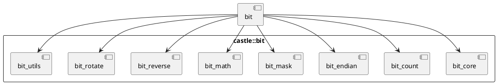

# `castle/bit/bit.h` — Umbrella header

**Header:** `castle/bit/bit.h`
**Namespace:** `castle::bit`
**Sample:** [`samples/sample_bit.cpp`](../../samples/sample_bit.cpp)

## Purpose

Single-include convenience header. Pulls in every submodule under
`castle/bit/` so callers can just write:

```cpp
#include <castle/bit/bit.h>
using namespace castle::bit;
```

and gain access to bit test/set/clear/toggle, popcount, endian swap,
masks, math helpers, reverse and rotate operations, plus low-level
field extraction / insertion utilities.

## What it includes

| Sub-header                | Category                                    |
| ------------------------- | ------------------------------------------- |
| `bit_core.h`              | `test`, `set`, `clear`, `toggle`            |
| `bit_count.h`             | `popcount`, `count_leading_zeros`, `parity` |
| `bit_endian.h`            | `byte_swap`                                 |
| `bit_mask.h`              | `single_bit_mask`, `low/high/range_mask`    |
| `bit_math.h`              | `is_power_of_two`, `align_up/down`, `sign`  |
| `bit_reverse.h`           | `reverse_bits`, `reverse_bytes`             |
| `bit_rotate.h`            | `rotate_left`, `rotate_right`               |
| `bit_utils.h`             | `extract_field`, `insert_field`             |

## Design notes

- All helpers are `constexpr` and `noexcept`; suitable for use in
  compile-time computations and safety-critical hot paths.
- Every function is SFINAE-constrained to `castle::types::is_valid_integer_v<T>`
  so misuse (floats, enums, pointers) fails at compile time.
- Both **runtime** overloads (index passed as function argument) and
  **compile-time** overloads (index passed as a template parameter with
  `static_assert` range checks) are provided.

## Diagram — module composition



## See also

- Per-header documents inside this folder.
- `castle/types/traits.h` — the `is_valid_integer_v` predicate.
