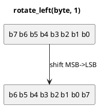

# `castle/bit/bit_rotate.h` — Circular shifts

**Header:** `castle/bit/bit_rotate.h`
**Namespace:** `castle::bit`
**Sample:** [`samples/sample_bit.cpp`](../../samples/sample_bit.cpp) — `demo_bit_rotate()`

## Purpose

`rotate_left` and `rotate_right` perform **circular** shifts (bits
shifted off one end re-enter the other end). Rotations are the core
mixing step of most non-cryptographic hashes (FNV-1a variants,
MurmurHash, xxHash, SipHash) and of many block ciphers, and they also
appear in some ring-buffer index arithmetic.

## Design notes

- `constexpr` + `noexcept`.
- `shift` is reduced modulo the width of `T`, so any rotation amount is
  well-defined; a zero-shift shortcut avoids the UB of shifting by the
  full type width on some platforms.
- Requires `castle::types::is_valid_integer_v<T>`.

## API

| Function                          | Returns |
| --------------------------------- | ------- |
| `rotate_left(T v, uint32_t s)`    | `T`     |
| `rotate_right(T v, uint32_t s)`   | `T`     |

## Example

```cpp
#include <castle/bit/bit_rotate.h>
using namespace castle::bit;

static_assert(rotate_left<uint8_t>(0b1000'0001, 1) == 0b0000'0011);
static_assert(rotate_right<uint8_t>(0b0000'0011, 1) == 0b1000'0001);
```

## Diagram



## See also

- `bit_reverse.h` — for full bit reversal, not rotation.
