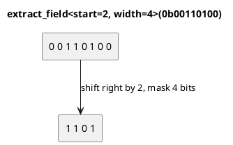

# `castle/bit/bit_utils.h` — Field extract / insert

**Header:** `castle/bit/bit_utils.h`
**Namespace:** `castle::bit`
**Sample:** [`samples/sample_bit.cpp`](../../samples/sample_bit.cpp) — `demo_bit_utils()`

## Purpose

Read and write **contiguous bit fields** inside a word, plus two
low-level helpers to isolate the lowest or highest set bit. This is the
canonical operation when talking to hardware registers whose layout is
described by "bits `[start .. start+width-1]` are the FOO field".

## Design notes

- `extract_field` / `insert_field` come in two flavours:
  - Runtime: `f(value, start_bit, width)` — bounds are checked and
    the operation degrades gracefully (returns `0`, or leaves `dest`
    untouched) instead of triggering UB.
  - Compile-time: `f<start_bit, width>(value)` — `static_assert` guards
    both `width > 0` and `start_bit + width <= bit-width of T`.
- `extract_lowest_set_bit(x)` uses the classic `x & -x` trick on the
  unsigned form of `x`.
- `extract_highest_set_bit(x)` performs a **bit-smear** (fill everything
  below the top set bit with 1s) followed by `v - (v >> 1)`; both are
  branch-free.

## API

| Function                                                     | Description                    |
| ------------------------------------------------------------ | ------------------------------ |
| `extract_lowest_set_bit(v)`                                  | Word with only lowest bit set  |
| `extract_highest_set_bit(v)`                                 | Word with only highest bit set |
| `extract_field(v, start, width)`                             | Field, shifted to bit 0        |
| `extract_field<start, width>(v)`                             | Compile-time checked           |
| `insert_field(dest, field_val, start, width)`                | `dest` with field replaced     |
| `insert_field<start, width>(dest, field_val)`                | Compile-time checked           |

All functions require `castle::types::is_valid_integer_v<T>`.

## Example — talking to a hypothetical UART CTRL register

```cpp
#include <castle/bit/bit_utils.h>
using namespace castle::bit;

// UART_CTRL: [ parity:2 (bits 4-5) | stop:1 (bit 3) | baud_div:3 (bits 0-2) ]
uint8_t ctrl = 0;
ctrl = insert_field<0, 3>(ctrl, 0b101); // baud_div = 5
ctrl = insert_field<3, 1>(ctrl, 1);     // 2 stop bits
ctrl = insert_field<4, 2>(ctrl, 0b10);  // even parity

auto baud   = extract_field<0, 3>(ctrl); // 5
auto parity = extract_field<4, 2>(ctrl); // 2
```

## Diagram



## See also

- `bit_mask.h` — the primitive masks used internally.
- `bit_core.h` — for **single-bit** operations.
