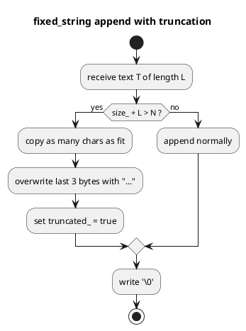

# `castle/buffers/fixed_string.h` — Stack-allocated string builder

**Header:** `castle/buffers/fixed_string.h`
**Namespace:** `castle::buffers`
**Sample:** [`samples/sample_fixed_string.cpp`](../../samples/sample_fixed_string.cpp)

## Purpose

`fixed_string<N>` is an **append-only**, bounded char buffer used to
assemble log records, diagnostic messages, and formatted strings
**without any heap allocation**. It is the backing storage of
`castle::logging`.

## Design notes

- Total footprint: `N + 1` bytes (extra byte for the terminating NUL)
  plus a `size_type` and a `bool truncated_` flag.
- `static_assert(N >= 16)` — leaves room for at least a short prefix
  plus the `"..."` truncation sentinel.
- On overflow, the appended text is **silently truncated** and the
  last 3 bytes are overwritten with `"..."` so operators can see that
  clipping happened. `truncated()` returns `true` in that case.
- `c_str()` is always NUL-terminated; `view()` returns a `std::string_view`
  for zero-copy handoff to sinks / formatters.
- Not thread-safe — the logger serialises access via its own mutex.

## API

| Method                                     | Notes                              |
| ------------------------------------------ | ---------------------------------- |
| `capacity()`                               | `constexpr` = `N`                  |
| `size()` / `empty()` / `truncated()`       | O(1)                               |
| `c_str()`                                  | NUL-terminated pointer             |
| `view()`                                   | `std::string_view`                 |
| `clear()`                                  | Resets size and truncated flag     |
| `append(std::string_view)`                 | Bulk append                        |
| `append(const char*)`                      | Handles `nullptr` -> `"(null)"`    |
| `append(char)`                             | Single character                   |
| `append(const std::string&)`               | STL string                         |
| `append(int / long / long long / ...)`     | Formatted via `%d` / `%lld` / ...  |
| `append(unsigned int / ...)`               | Formatted via `%u` / ...           |
| `append(float / double)`                   | Formatted via `"%g"`               |
| `begin/end`, `rbegin/rend`, `operator[]`   | Random-access iteration            |

## Diagram



## Example

```cpp
#include <castle/buffers/fixed_string.h>
using castle::buffers::fixed_string;

fixed_string<64> msg;
msg.append("temp=");
msg.append(23.5f);
msg.append(" cnt=");
msg.append(42);
puts(msg.c_str());
if (msg.truncated()) log_overflow();
```

## See also

- `castle/logging/logging.h` — the primary consumer of `fixed_string`.
