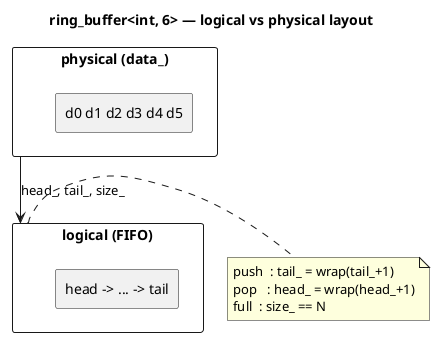

# `castle/buffers/ring_buffer.h` — Bounded FIFO circular buffer

**Header:** `castle/buffers/ring_buffer.h`
**Namespace:** `castle::buffers`
**Sample:** [`samples/sample_ring_buffer.cpp`](../../samples/sample_ring_buffer.cpp)

## Purpose

`ring_buffer<T, N>` is a fixed-capacity, **heap-free** FIFO circular
queue intended for producer/consumer streams on safety-critical
embedded targets: UART/CAN receive queues, sample buffers, event
queues, task inboxes, etc.

## Design notes

- **Capacity `N` is a compile-time constant.** All storage is inline
  (`std::array<T, N>`); no allocation, no exception path.
- **Trivial `T` only.** `static_assert`ed to be trivially copyable and
  trivially destructible, so `push` / `pop` can never throw or leak.
- **Every operation is `noexcept`.** Error signalling is via `bool`
  return values.
- **Two documented overflow policies:**
  - `push(v)` — returns `false` when full, buffer unchanged (strict).
  - `force_push(v)` — always succeeds; if full, drops the oldest
    element and returns `true` to tell the caller that data was lost.
- Non-copyable / non-movable — a ring buffer normally represents a
  shared streaming endpoint. Callers can wrap it in a smart handle if
  transfer is really desired.
- **Not thread-safe on its own.** For SPSC use, add the required
  memory barriers at the call site; for MPMC, serialise with a mutex.
- Iterators walk the **logical FIFO order** (oldest → newest), not the
  physical array layout. Full random-access category, `reverse_iterator`
  supported.

## API (excerpt)

| Method                          | Notes                                             |
| ------------------------------- | ------------------------------------------------- |
| `capacity()`                    | `constexpr` = `N`                                 |
| `size()`, `empty()`, `full()`   | O(1)                                              |
| `available()`                   | `N - size()`                                      |
| `clear()`                       | O(1)                                              |
| `push(v)` / `push(&&v)`         | Strict; `false` when full                         |
| `force_push(v)`                 | Overwrites oldest; returns `true` on eviction     |
| `pop(T& out)` / `pop()`         | `false` when empty                                |
| `peek(index, out)`              | Non-destructive random peek                       |
| `front()` / `back()`            | UB when empty (precondition)                      |
| `push_bulk(src, n)` etc.        | Bulk copy helpers                                 |
| `begin/end`, `rbegin/rend`      | Random-access FIFO-order iteration                |

## Diagram



## Example

```cpp
#include <castle/buffers/ring_buffer.h>
using namespace castle::buffers;

ring_buffer<uint8_t, 32> rx;

// ISR side
if (!rx.push(byte_from_uart)) {
    // strict: drop or count overrun
}

// task side
uint8_t b;
while (rx.pop(b)) { process(b); }
```

## See also

- `castle/buffers/stack_buffer.h` — same primitives, LIFO semantics.
- `castle/iterators/iterator.h` — the underlying iterator machinery.
