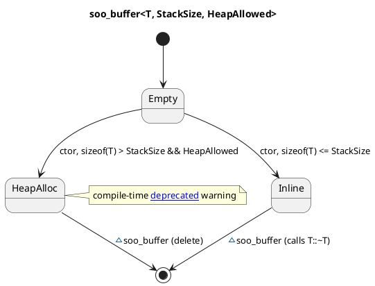

# `castle/buffers/soo_buffer.h` — Small-Object Optimisation buffer

**Header:** `castle/buffers/soo_buffer.h`
**Namespace:** `castle::buffers`
**Sample:** [`samples/sample_soo_buffer.cpp`](../../samples/sample_soo_buffer.cpp)

## Purpose

`soo_buffer<T, StackSize, HeapAllowed>` stores a single `T` **inline**
when it fits within `StackSize` bytes, and otherwise transparently
falls back to a heap allocation (unless the caller opts out).

Typical use: hold a polymorphic strategy object or callable of unknown
size **without** paying for a heap allocation in the common case.

## Design notes

- Storage is a union of `char inline_buffer[StackSize]` and a `T*
  heap_buffer`, aligned to `max(alignof(T), alignof(T*))`.
- Construction path (`if constexpr (sizeof(T) <= StackSize)`):
  - **Fits:** placement-new into `inline_buffer`. No heap touched.
  - **Doesn't fit:** `new T(...)` on the heap. A
    `[[deprecated]]` marker (`warn_if_heap_allocation`) emits a
    compile-time warning so the fallback is visible to reviewers.
- If the template parameter `HeapAllowed == false`, an attempt to
  instantiate the buffer with `sizeof(T) > StackSize` **fails to
  compile** (SFINAE-guarded constructor).
- Move-only (copy is deleted). Move steals the heap pointer or
  placement-moves the inline object; the moved-from buffer is left in
  a valid, empty state.
- `get()` returns a `T*` regardless of where the object lives;
  `is_heap()` lets the caller inspect where it ended up.
- `std::launder` is used on the reinterpretation of `inline_buffer`.

## API

| Member                    | Notes                                             |
| ------------------------- | ------------------------------------------------- |
| `soo_buffer(Arg&&)`       | SFINAE-constrained on `HeapAllowed`               |
| `soo_buffer(soo_buffer&&)`| Move; copy is deleted                             |
| `get()` / `get() const`   | `T*` / `const T*` to the held object              |
| `is_heap() const`         | `bool`; true iff heap fallback was taken          |

## Diagram



## Example

```cpp
#include <castle/buffers/soo_buffer.h>
using castle::buffers::soo_buffer;

// Force fully stack-resident, otherwise won't compile:
soo_buffer<my_strategy, 64, /*HeapAllowed=*/false> s{my_strategy{...}};
s.get()->run();
```

## Notes / pitfalls

- Increasing `StackSize` bumps the object's footprint even when a
  small `T` is stored — pick a size that matches the largest expected
  variant.
- The fallback branch calls global `new`/`delete`; make sure your
  target's allocator is present when `HeapAllowed == true`.

## See also

- `castle/callbacks/inplace_function.h` — same idea applied to
  callables, always heap-free.
