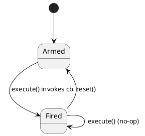

# `castle/callbacks/callback_policy.h` — Control-flow policies

**Header:** `castle/callbacks/callback_policy.h`
**Namespace:** `castle::callbacks::policy`
**Sample:** [`samples/sample_callback_policy.cpp`](../../samples/sample_callback_policy.cpp)

## Purpose

A collection of small **control-flow decorators** that decide *when* a
bound callback should actually run — one-shot, every N calls, throttled,
or periodic. Everything is header-only, heap-free, and the callable is
captured by value at construction and never rebound.

Typical use: turn any callable (raw lambda, `inplace_function`,
`function_ct_*`, …) into a "run once at boot", "only every 100 ticks",
"at most once per 500 ms" wrapper.

## Design notes

- **Zero heap allocation.** The callable is stored **by value** as a
  template parameter — no `std::function`, no `unique_ptr`, no owned
  threads or timers.
- **Bind once.** Only the call-site arguments are forwarded on
  `execute()`.
- **Thread-safety is opt-in per policy:**
  - `single_thread` (default) — no synchronisation, cheapest.
  - `concurrent` — atomic CAS, no mutex, no heap.
- **Time-based policies are poll-driven.** They own no threads; the
  caller pumps them from a cooperative event loop.
- **Factories** deduce the callable type so the caller uses `auto`:

  ```cpp
  auto p = policy::once::make_policy_st([]{ boot_hw(); });
  p.execute();
  ```

## Naming convention

| Suffix                     | Meaning                                             |
| -------------------------- | --------------------------------------------------- |
| `make_policy_st`           | Single-thread (non-synchronised, cheapest)          |
| `make_policy_concurrent`   | Atomic-based, safe from multiple threads            |
| `make_policy_ct<N>`        | Compile-time parameter (e.g. `every_n<N>`)          |
| `..._with_clock<Clock>`    | Override the default `std::chrono::steady_clock`    |

## Policies

### `once`
Fire the callback **exactly one time** for the object's lifetime.
`reset()` re-arms it; `has_fired()` reports state.

- `once::single_thread<Callable>` — simple `bool fired_` flag.
- `once::concurrent<Callable>` — CAS on `std::atomic<bool>`; at most
  one caller wins the race.

### `every_n<N>` (compile-time N)
Runs the callback on every N-th `execute()` call. `N` is a template
parameter so the compiler strength-reduces the modulo.

### `throttle<Duration>` (rate limit)
Runs the callback at most once per `Duration` of elapsed time,
measured against the injected clock. Poll-driven — the caller keeps
calling `execute()`; internal state decides whether to dispatch.

### `periodic<Duration>` (min-interval)
Runs the callback each time at least `Duration` has elapsed since the
last dispatch. Also poll-driven.

## Example

```cpp
#include <castle/callbacks/callback_policy.h>
using namespace castle::callbacks::policy;

auto init = once::make_policy_st([]{ boot_hw(); });
init.execute();          // runs boot_hw
init.execute();          // no-op

auto beat = every_n::make_policy_ct<10>([]{ heartbeat(); });
for (int i = 0; i < 100; ++i) beat.execute();  // 10 dispatches

auto safe_log = throttle::make_policy_st(
    std::chrono::milliseconds{500},
    [](std::string_view s){ printf("%.*s\n", (int)s.size(), s.data()); });

while (running) {
    safe_log.execute("still alive");  // at most 2 Hz
    tick();
}
```

## Diagram — `once` state machine



## See also

- `castle/callbacks/function.h`, `inplace_function.h` — the callable
  wrappers that pair naturally with these policies.
- `castle/events/tick_timer.h` — for driven, tick-based periodic
  execution as opposed to poll-based throttling.
