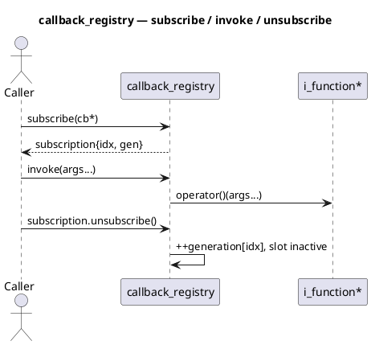

# `castle/callbacks/callback_registry.h` — Non-owning pub/sub

**Header:** `castle/callbacks/callback_registry.h`
**Namespace:** `castle::callbacks`
**Sample:** [`samples/sample_callback_registry.cpp`](../../samples/sample_callback_registry.cpp)

## Purpose

`callback_registry<max_callback, void(Args...)>` is a **fixed-capacity,
non-owning** publisher/subscriber primitive:

- Stores up to `max_callback` pointers to `i_function<void(Args...)>`.
- Invokes them **in registration order** on a single `invoke(args...)`
  call.
- Hands out a lightweight `callback_subscription` handle for
  identity-safe unsubscribe.

It underpins the higher-level `event_dispatcher`, `signal_event`, and
`tick_timer` when you want to own the callable objects yourself (e.g.
as `function_ct_im<...>` members with zero per-callback footprint).

## Design notes

- **Non-owning:** the registry only stores raw
  `i_function<void(Args...)>*` values. The caller is responsible for
  keeping the callback object alive until `unsubscribe()` /
  `clear()` / registry destruction.
- **`void` return only.** A non-`void` signature triggers a
  `static_assert`, since the registry has no meaningful way to fan-out
  multiple return values.
- **Generation-counter identity.** Each slot has a `uint32_t generation`
  counter that increments on deactivation. A subscription handle carries
  `(index, generation)` and a back-pointer to the registry via the
  type-erased `i_unsubscribable` base; stale handles are detected and
  return `invalid_subscription`.
- **No heap, no exceptions.** Every operation is `noexcept` and error
  signalling uses `callback_subscription_error`.
- **Non-copyable, non-movable** — identity is fused into every
  outstanding subscription's back-pointer.

## Error codes

```cpp
enum class callback_subscription_error : uint8_t {
    ok = 0,
    full,
    invalid_callback,
    invalid_subscription
};
```

## API

| Method                                    | Notes                                   |
| ----------------------------------------- | --------------------------------------- |
| `subscribe(cb*, err_out = nullptr)`       | Returns `callback_subscription`|
| `unsubscribe_slot(idx, gen)`              | Type-erased entry (subscription uses)   |
| `invoke(args...)` / `operator()(args...)` | Fans out in registration order          |
| `clear()`                                 | Bumps generation on all slots           |
| `size()` / `capacity()` / `full()`        | Introspection                           |

## Diagram — lifetime



## Example

```cpp
#include <castle/callbacks/callback_registry.h>
#include <castle/callbacks/function.h>
using namespace castle::callbacks;

void on_temp(float);
function_ct<&on_temp> cb1;              // zero-storage callback

callback_registry<4, void(float)> hub;

auto sub = hub.subscribe(&cb1);
hub.invoke(23.5f);                      // fans out to cb1
sub.unsubscribe();                      // slot released
```

## See also

- `castle/callbacks/function.h` — supplies the `i_function<...>`
  concrete variants.
- `castle/callbacks/inplace_callback_registry.h` — owning counterpart
  that also stores captures inline.
- `castle/events/event_dispatcher.h` — multi-event façade on top of
  this primitive.
