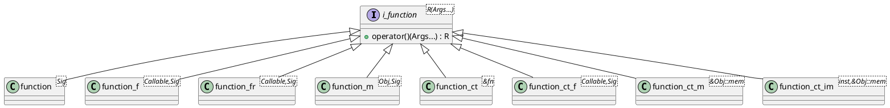

# `castle/callbacks/function.h` — Non-owning callable wrappers

**Header:** `castle/callbacks/function.h`
**Namespace:** `castle::callbacks`
**Samples:** [`sample_function.cpp`](../../samples/sample_function.cpp), [`sample_callback_registry.cpp`](../../samples/sample_callback_registry.cpp)

## Purpose

A family of small callable adapters built around a common virtual
interface `i_function<R(Args...)>`. Each variant binds a different kind
of target (free function, functor, member function, compile-time
addresses) and is intended to be **held by pointer** through
`i_function<R(Args...)>*` — for example by `callback_registry`,
`event_dispatcher`, `tick_timer` and `signal_event`.

Every variant is heap-free and non-throwing on the hot path; the object
lifetime is owned by the caller (usually a local or a member of a
class), never by the registry.

## Design notes

- **Common base:** `i_function<R(Args...)>` is a signature-aware
  abstract with `operator()(Args...) -> R`. Mis-spelt instantiations
  such as `i_function<int, float>` fail to compile with an
  "incomplete type" diagnostic.
- **Runtime-bound variants** (target address stored as a member; costs
  one indirection per call):
  - `function<R(Args...)>` — free / static function pointer.
  - `function_f<Callable, R(Args...)>` — owns a functor / lambda **by
    value**. `make_function_f<Signature>(callable)` deduces `Callable`.
  - `function_fr<Callable, R(Args...)>` — holds a functor **by
    reference**. `make_function_fr<Signature>(callable)` factory.
  - `function_m<ObjType, R(Args...)>` — bound member function; stores
    the object reference plus the member pointer.
- **Compile-time-bound variants** (target address is a *template
  parameter*; the compiler often inlines the call, zero per-instance
  storage for the pointer):
  - `function_ct<&free_fn>` — signature deduced.
  - `function_ct_f<Callable, R(Args...)>` — default-constructible
    functor whose type carries the target.
  - `function_ct_m<&Handler::on_tick>` — member function; instance
    still bound at runtime (constructor argument).
  - `function_ct_im<g_handler, &Handler::on_tick>` — both instance
    **and** member are compile-time bound; the object is empty.
- `void` and non-`void` return types both work; `callback_registry`
  separately enforces `R == void` on the pointers it stores.

## Diagram — class family



## Example

```cpp
#include <castle/callbacks/function.h>
using namespace castle::callbacks;

void on_tick_free();

struct Handler {
    void on_tick(int v);
};
Handler h;

// runtime-bound
function<void()>                       cb1(&on_tick_free);
function_m<Handler, void(int)>         cb2(h, &Handler::on_tick);
auto                                   cb3 = make_function_f<void(int)>(
                                             [](int v){ /* ... */ });

// compile-time bound
function_ct<&on_tick_free>             cb4;                 // zero pointer stored
function_ct_m<&Handler::on_tick>       cb5(h);
```

## See also

- `castle/callbacks/callback_registry.h` — non-owning fixed-capacity
  registry of `i_function<void(Args...)>*`.
- `castle/callbacks/inplace_function.h` — self-owning, SBO variant
  used when the registry needs to store the callable itself.
