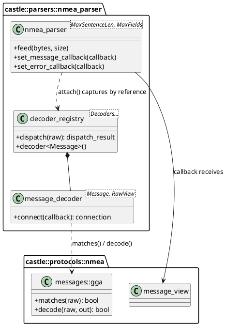
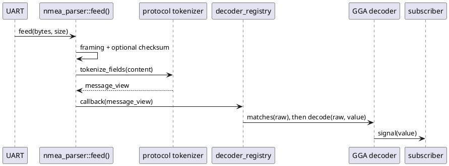

# NMEA 0183 Protocol & nmea_parser — Workshop Documentation

> **Target audience:** GNSS newcomers — developers new to location services who want to understand the NMEA 0183 ASCII sentence protocol and quickly integrate the `nmea_parser` C++ library.

---

## Table of Contents

### Part 1 — NMEA 0183 Protocol: Theory
1. [What is NMEA 0183?](#1-what-is-nmea-0183)
2. [NMEA Sentence Structure](#2-nmea-sentence-structure)
3. [Talker IDs and Sentence Types](#3-talker-ids-and-sentence-types)
4. [Data Field Conventions](#4-data-field-conventions)
5. [Checksum Algorithm — XOR](#5-checksum-algorithm--xor)
6. [Communication Interface Basics](#6-communication-interface-basics)
7. [Key Concepts Glossary](#7-key-concepts-glossary)

### Part 2 — nmea_parser Library: Developer Guide
8. [Library Overview](#8-library-overview)
9. [Architecture Overview](#9-architecture-overview)
10. [Quick Start: Parsing a Byte Stream](#10-quick-start-parsing-a-byte-stream)
11. [Streaming Input and View Lifetimes](#11-streaming-input-and-view-lifetimes)
12. [Typed Decoders and the Registry](#12-typed-decoders-and-the-registry)
13. [Decoding NMEA Sentences](#13-decoding-nmea-sentences)
14. [Building NMEA Sentences](#14-building-nmea-sentences)
15. [Errors, Counters, and Recovery](#15-errors-counters-and-recovery)
16. [Project Integration](#16-project-integration)
17. [Constraints and Common Mistakes](#17-constraints-and-common-mistakes)

---

---

# Part 1 — NMEA 0183 Protocol: Theory

> This part is a simplified, beginner-friendly reference based on the NMEA 0183 standard. Read it first to understand what NMEA 0183 is, why it exists, and how its sentences are structured — before exploring the `nmea_parser` library.

---

## 1. What is NMEA 0183?

> NMEA 0183 is a standard text-based protocol for communication between navigation devices (particularly GNSS/GPS receivers) and host computers. The name comes from the National Marine Electronics Association, which originally defined the standard.

### The problem it solves

Imagine a GNSS chip soldered to a circuit board. It continuously computes your position, speed, and time from satellite signals. Your application needs that data, but how should the chip communicate it?

It sends characters over a serial wire. Without an agreed format, those characters are meaningless. **NMEA 0183 is the agreed language** — a text protocol that defines precisely how each sentence is formatted, so both sides can reliably exchange data.

> **Analogy:** NMEA 0183 is like a standardised CSV report format. Every row (sentence) has clearly labelled columns, so any program that knows the format can read the data — even from a device it has never seen before.

### NMEA 0183 vs. UBX — which should you use?

Both protocols are used with u-blox GNSS receivers. They serve different purposes:

| Aspect | NMEA 0183 | UBX (u-blox binary) |
|---|---|---|
| Format | ASCII text — human-readable | Binary — compact and machine-readable |
| Primary purpose | Navigation data output | Full receiver control + rich data output |
| Can configure the receiver | **No** — output only | **Yes** — the only way on u-blox chips |
| Data richness | Moderate (position, velocity, time) | Very high (raw measurements, survey data, IMU fusion) |
| Interoperability | Works with any NMEA-compatible tool | u-blox specific |
| Parser complexity | Simple string splitting | Requires a binary state machine |
| Bandwidth | 3–4× larger than equivalent UBX | Compact binary |

**Use NMEA 0183 when:**
- You need human-readable output for debugging.
- A third-party tool (e.g., mapping software, GIS platform) requires NMEA input.
- You need only basic position, speed, and heading data.
- You are integrating with a multi-vendor system where receiver independence matters.

**Use UBX when:**
- You must configure the receiver (message rates, port settings, power modes, etc.).
- You need high-rate, high-precision data (carrier phase, accuracy estimates, raw measurements).
- You are writing production firmware where efficiency and determinism matter.

> **Key takeaway:** On u-blox receivers, NMEA 0183 is a standard output format. Configuration still requires UBX. Many production systems use both: UBX to configure the chip at startup, and NMEA to read the data stream.

---

## 2. NMEA Sentence Structure

### Every NMEA sentence looks the same on the outside

No matter what data is inside, every NMEA 0183 sentence follows the same character layout. Once you understand the structure of one sentence, you can read any of them.

### Anatomy of a sentence

Here is a complete, real-world NMEA sentence from a u-blox ZED-F9R receiver:

```
$GNGGA,092725.00,4717.11399,N,00833.91590,E,1,08,1.01,499.6,M,48.0,M,,*47\r\n
```

Let's break it down character by character:

```
GN: Talker ID (GN = multi-constellation)
GGA: Sentence type (GGA = position fix)
092725.00: UTC time
4717.11399,N: Latitude
00833.91590,E: Longitude
1: Fix quality (1 = GPS fix)
08: Satellites used
1.01: HDOP
499.6,M: Altitude (499.6 meters above mean sea level)
48.0,M: Geoid separation (48.0 meters)
(empty): DGPS age (not used)
(empty): DGPS station ID (not used)
*47: Checksum (XOR of all characters between '$' and '*')
\r\n: Line terminator (carriage return + line feed)
```

### Visual diagram of sentence fields

```
┌───┬──────────┬──────────────┬───┬──────────────────────────────┬───┬────┬────────┐
│ $ │ Talker   │ Sentence Type│ , │   Comma-separated data fields│ * │ CS │ \r\n   │
└───┴──────────┴──────────────┴───┴──────────────────────────────┴───┴────┴────────┘
  1      2-3         3-5       1            variable               1    2      2
```

### Field-by-field description

| Field | Characters | Example | Description |
|---|---|---|---|
| **Start delimiter** | `$` | `$` | Marks the beginning of a sentence. Every sentence starts with exactly one `$`. |
| **Talker ID** | 2 (or 1 for proprietary) | `GN` | Identifies which navigation system or device produced the sentence. |
| **Sentence type** | 3 | `GGA` | Identifies the sentence format and what data it contains. |
| **Data fields** | Variable | `092725.00,...` | Comma-separated values. Empty commas (`,,`) represent optional or unavailable fields. |
| **Checksum delimiter** | `*` | `*` | Separates the data from the checksum. |
| **Checksum** | 2 hex digits | `47` | XOR of all characters between `$` and `*`. Used to catch transmission errors. |
| **Line terminator** | `\r\n` | `\r\n` | Carriage return + Line feed. Always present at the end of a sentence. |

### Key rules

- Maximum sentence length: **82 characters** (including `$` and `\r\n`), per the standard.
  Some extended proprietary sentences (e.g., u-blox `PUBX`) may exceed this limit.
- The checksum is **always two uppercase hex digits** (e.g., `3A`, `0F`, `47`).
- Fields are **always separated by commas**, even when empty.
- The **`$`, `*`, and `\r\n`** are not data — they are framing characters.

---

## 3. Talker IDs and Sentence Types

### What is a Talker ID?

A Talker ID is a 2-character code at the start of every NMEA sentence (just after `$`).  
It identifies which navigation system or device is the source of the sentence.

> **Analogy:** Think of a Talker ID like a radio call sign. It tells you who is speaking before you listen to what they say.

### Table of common Talker IDs

| Talker ID | System | Example sentences |
|---|---|---|
| `GP` | GPS (US satellite navigation system) | `$GPGGA`, `$GPRMC` |
| `GL` | GLONASS (Russian satellite navigation system) | `$GLGSV` |
| `GA` | Galileo (European satellite navigation system) | `$GAGSV` |
| `GB` | BeiDou (Chinese satellite navigation system) | `$GBGSV` |
| `GQ` | QZSS (Japanese regional navigation system) | `$GQGSV` |
| `GN` | Combined GNSS (data blended from multiple constellations) | `$GNGGA`, `$GNRMC` |
| `II` | Integrated Instrumentation | `$IIHDG` |
| `P` | Proprietary (manufacturer-specific) | `$PUBX,...` |

> **Tip:** Modern multi-constellation receivers (e.g., u-blox ZED-F9R) typically output `GN` sentences when the fix uses satellites from more than one constellation. Your code must handle both `GP` and `GN` variants.

### What is a Sentence Type?

A Sentence Type is a 3-character code that immediately follows the Talker ID.  
It defines the **structure and meaning** of all the data fields that follow.

> **Analogy:** If the Talker ID is the speaker, the Sentence Type is the topic of the announcement — "position update", "satellite status", "course and speed", etc.

### Table of well-known sentence types

| Type | Full name | What it contains |
|---|---|---|
| `GGA` | Global Positioning System Fix Data | Position, altitude, fix quality, satellite count, HDOP |
| `RMC` | Recommended Minimum Specific GNSS Data | Position, speed, course, date/time, status |
| `GSA` | GNSS DOP and Active Satellites | Fix mode, DOP values (PDOP/HDOP/VDOP), active satellite IDs |
| `GSV` | GNSS Satellites in View | Per-satellite: PRN, elevation, azimuth, SNR |
| `GLL` | Geographic Position Latitude/Longitude | Position only, with status |
| `VTG` | Course Over Ground and Ground Speed | Speed (knots + km/h) and course (true + magnetic) |
| `GNS` | GNSS Fix Data | Multi-constellation position fix with mode indicators |
| `ZDA` | Time and Date | Full UTC date and time with timezone offset |
| `GBS` | GNSS Satellite Fault Detection | Error estimates for lat/lon/alt |
| `GST` | GNSS Pseudo Range Error Statistics | Position error statistics (RMS) |
| `DTM` | Datum Reference | Local datum and offset from WGS84 |
| `TXT` | Text Transmission | Human-readable device text messages |

### Examples of complete sentences

```
# GGA — Position fix (GPS only)
$GPGGA,123519,4807.038,N,01131.000,E,1,08,0.9,545.4,M,46.9,M,,*47\r\n

# GGA — Position fix (Combined GNSS, from a u-blox ZED-F9R)
$GNGGA,092725.00,4717.11399,N,00833.91590,E,1,08,1.01,499.6,M,48.0,M,,*6A\r\n

# RMC — Minimum navigation data
$GNRMC,092725.00,A,4717.11399,N,00833.91590,E,0.004,77.52,160223,,,A*60\r\n

# GSV — GPS satellites in view (part 1 of 2)
$GPGSV,2,1,05,21,40,083,46,05,35,141,47,25,42,057,50,46,38,103,34*74\r\n

# GSV — GPS satellites in view (part 2 of 2)
$GPGSV,2,2,05,16,08,320,19*40\r\n

# GSA — DOP and active satellites
$GNGSA,A,3,21,05,25,46,16,,,,,,,,1.5,0.9,1.2,1*3A\r\n

# VTG — Speed and course
$GNVTG,77.52,T,,M,0.004,N,0.007,K,A*3F\r\n

# ZDA — Date and time
$GNZDA,092725.00,16,02,2023,00,00*7D\r\n
```

---

## 4. Data Field Conventions

### How to read a sentence field definition table

Every sentence type has a fixed field layout. Documentation tables list each field with:
- Its **zero-based index** (position after the sentence identifier).
- The **format string** describing the expected content.
- Whether the field is **mandatory** or **optional** (empty when unavailable).

Example: GGA sentence field table

```
$--GGA,hhmmss.ss,llll.ll,a,yyyyy.yy,a,x,xx,x.x,x.x,M,x.x,M,x.x,xxxx*hh
```

| Index | Format | Name | Description |
|---|---|---|---|
| 0 | `hhmmss.ss` | UTC time | Hour, minute, second in UTC |
| 1 | `llll.ll` | Latitude | Degrees and decimal minutes (DDmm.mmmm) |
| 2 | `a` | N/S indicator | `N` = North, `S` = South |
| 3 | `yyyyy.yy` | Longitude | Degrees and decimal minutes (DDDmm.mmmm) |
| 4 | `a` | E/W indicator | `E` = East, `W` = West |
| 5 | `x` | Fix quality | 0=invalid, 1=GPS, 2=DGPS, 4=RTK fixed, 5=RTK float |
| 6 | `xx` | Satellites used | Number of satellites in the solution (0–12+) |
| 7 | `x.x` | HDOP | Horizontal dilution of precision |
| 8 | `x.x` | Altitude MSL | Height above mean sea level [metres] |
| 9 | `M` | Altitude units | Always `M` (metres) |
| 10 | `x.x` | Geoid separation | Difference between ellipsoid and geoid [metres] |
| 11 | `M` | Geoid units | Always `M` (metres) |
| 12 | `x.x` | DGPS age | Age of differential correction data [seconds]; empty if unused |
| 13 | `xxxx` | DGPS station ID | Reference station ID; empty if unused |

### Common field formats

#### UTC time — `hhmmss.ss`

The time field is a single decimal number encoding hours, minutes, and seconds:

```
092725.00  →  09 hours, 27 minutes, 25.00 seconds (UTC)
```

Unpack it like this:

```cpp
double utc_time = 92725.00;
int    hour   = (int)(utc_time / 10000);        // 9
int    minute = (int)(fmod(utc_time, 10000) / 100); // 27
double second = fmod(utc_time, 100.0);           // 25.00
```

> **Note:** The value is in UTC, not local time. Always display it accordingly.

#### Latitude / Longitude — DDDMM.MMMM format

This is the most commonly misread NMEA format. It is **not** decimal degrees.

The format encodes **degrees and decimal minutes** as a single number:

```
4717.11399  →  47 degrees, 17.11399 minutes
```

The integer part divided by 100 gives the degrees:
```
4717.11399 / 100 = 47.1711399  →  floor = 47 degrees
```

The fractional remainder (after removing the degrees × 100) gives decimal minutes:
```
4717.11399 − 47 × 100 = 17.11399 minutes
```

Convert to decimal degrees:

```
decimal_degrees = degrees + minutes / 60
                = 47 + 17.11399 / 60
                = 47.285233°
```

With a direction indicator:
- `N` (North) → positive value
- `S` (South) → negate the value
- `E` (East) → positive value
- `W` (West) → negate the value

C++ conversion example:

```cpp
// raw = "4717.11399", dir = "N"
double raw = 4717.11399;
double degrees = std::floor(raw / 100.0);         // 47.0
double minutes = raw - degrees * 100.0;           // 17.11399
double decimal_degrees = degrees + minutes / 60.0; // 47.285233
// direction 'N' → positive, 'S' → negative
```

> **Warning:** Never treat `4717.11399` as `47.1711399°` decimal degrees — that is approximately 0.8 km off. Always split at the degree boundary first.

#### UTC date — `ddmmyy`

```
160223  →  day=16, month=02, year=2023
```

#### Status character — `A` / `V`

Many sentences include a single-character status:
- `A` = **Active** (data is valid)
- `V` = **Void** (data is invalid — no fix or receiver warning)

> **Always check this field before using position data from RMC or GLL sentences.**

#### Mode indicator — `A`, `D`, `E`, `N`, `S`

Present in RMC, VTG, and GLL sentences (NMEA 2.3+):

| Character | Meaning |
|---|---|
| `A` | Autonomous GNSS fix |
| `D` | Differential GNSS fix (DGPS/SBAS) |
| `E` | Estimated / dead reckoning |
| `M` | Manual input mode |
| `N` | Data not valid |
| `S` | Simulator |

#### Empty / optional fields

Many fields are only populated when data is available. When the receiver has no fix, optional fields are empty. The commas are still present as placeholders:

```
$GNGGA,000000.00,,,,,,0,00,99.0,,,,,,*68\r\n
                ││││               ↑↑
              empty latitude     empty DGPS fields
```

> **Always guard against empty fields before parsing their content.** An empty latitude field does not mean zero degrees — it means the field is unavailable.

---

## 5. Checksum Algorithm — XOR

### Why checksums matter

When bytes travel over a serial wire, electrical interference can flip a bit. The NMEA 0183 XOR checksum is a simple but effective test that catches most single-bit transmission errors.

### Which characters are included

The checksum is computed over **all characters strictly between `$` and `*`** — both delimiters are excluded.

```
$GNRMC,092725.00,A,4717.11399,N,00833.91590,E,0.004,77.52,160223,,,A*60\r\n
 ├─────────────────────────────────────────────────────────────────┤
                     XOR all these characters
```

### The algorithm: step-by-step

1. Start with an accumulator set to `0`.
2. For each character between `$` and `*`, XOR the accumulator with that character's ASCII value.
3. The final accumulator value is the checksum.
4. Format it as **two uppercase hexadecimal digits** (e.g., `5` → `05`, `96` → `60`).

```cpp
uint8_t compute_checksum(const char* sentence)
{
    uint8_t cs = 0u;
    // Skip leading '$'
    const char* p = (*sentence == '$') ? sentence + 1 : sentence;
    // XOR until '*' or end of string
    while (*p && *p != '*')
        cs ^= static_cast<uint8_t>(*p++);
    return cs;
}
```

### Worked example

Sentence: `$GPGGA,123519,4807.038,N,01131.000,E,1,08,0.9,545.4,M,46.9,M,,*47`

Content between `$` and `*`: `GPGGA,123519,4807.038,N,01131.000,E,1,08,0.9,545.4,M,46.9,M,,`

XOR computation:

```
'G'=0x47
0x47 ^ 'P'(0x50) = 0x17
0x17 ^ 'G'(0x47) = 0x50
0x50 ^ 'G'(0x47) = 0x17
0x17 ^ 'A'(0x41) = 0x56
0x56 ^ ','(0x2C) = 0x7A
... (continuing for all characters) ...
final result = 0x47  →  formatted as "47"  ✓
```

> **Tip:** A checksum failure does not necessarily mean the sentence is unusable — some legacy devices omit the checksum entirely. However, if a checksum is present and wrong, the sentence should be discarded.

---

## 6. Communication Interface Basics

### Physical layer — UART serial

NMEA 0183 was designed for RS-232 serial communication, but on modern embedded hardware it typically uses **TTL-level UART** (3.3V or 5V logic).

The key parameters:
- **Baud rate:** The standard default is **4800 baud**. Modern GNSS receivers typically default to **9600** or **115200** baud and can be configured via UBX commands.
- **Data format:** 8 data bits, No parity, 1 stop bit (**8N1**) — the universal default.
- **Flow control:** None (hardware flow control is not used for NMEA output).

### Periodic sentences

By default, a GNSS receiver outputs a bundle of NMEA sentences once per second (1 Hz). Each bundle (one navigation epoch) typically contains:

```
$GNGGA,...  ← position fix
$GNRMC,...  ← minimum navigation data
$GNGSA,...  ← DOP and active satellites
$GPGSV,...  ← GPS satellites in view (may be multiple sentences)
$GLGSV,...  ← GLONASS satellites in view
$GNVTG,...  ← course and speed
```

Sentence output rates can be changed using UBX `CFG-MSG` or `CFG-VALSET` commands.

### Polling

Some sentence types can be polled on demand by sending a query sentence to the receiver. This is less common than periodic output and is not covered by this library.

### Proprietary sentences — `$P...`

When the Talker ID is the single character `P`, the sentence is proprietary — defined by the device manufacturer, not the NMEA standard.

u-blox uses `$PUBX,...` sentences for additional output that does not fit into standard NMEA frames. Third-party software generally does not understand proprietary sentences; only the manufacturer's documentation describes their format.

```
$PUBX,00,081350.00,4717.113210,N,00833.915187,E,546.589,G3,2.1,2.0,0.007,77.52,0.007,,18,18,18,0*7C\r\n
```

---

## 7. Key Concepts Glossary

| Term | Definition |
|---|---|
| **GNSS** | Global Navigation Satellite System — the umbrella term for all satellite navigation systems: GPS (US), GLONASS (Russia), Galileo (EU), BeiDou (China), QZSS (Japan). |
| **NMEA 0183** | A text-based standard protocol for communication between navigation instruments. Defined by the National Marine Electronics Association. |
| **Talker ID** | Two-character code identifying the source system of an NMEA sentence (e.g., `GP` = GPS, `GN` = multi-constellation). |
| **Sentence type** | Three-character code identifying the format and content of an NMEA sentence (e.g., `GGA`, `RMC`). |
| **Fix** | A computed position solution based on signals from two or more satellites. A fix is valid when the receiver has enough satellite geometry to compute a reliable position. |
| **UTC** | Coordinated Universal Time — the world's primary time standard. GNSS receivers output time in UTC. |
| **Epoch** | One complete navigation update cycle. Typically corresponds to one second's worth of NMEA sentences from a receiver. |
| **Latitude** | Angular distance north or south of the equator, measured in degrees (−90° to +90°). |
| **Longitude** | Angular distance east or west of the prime meridian, measured in degrees (−180° to +180°). |
| **Altitude / Height** | Vertical position. NMEA GGA reports altitude above mean sea level (MSL). |
| **DOP** | Dilution of Precision — a dimensionless multiplier expressing the effect of satellite geometry on position accuracy. Lower is better. HDOP ≤ 2 is generally considered good. |
| **HDOP** | Horizontal DOP — affects horizontal (lat/lon) accuracy. |
| **VDOP** | Vertical DOP — affects vertical (altitude) accuracy. |
| **PDOP** | Position (3D) DOP — combined 3D accuracy factor. |
| **Satellite / SV** | Space Vehicle — a single satellite in a GNSS constellation. Identified by its PRN or SV ID number. |
| **PRN** | Pseudo-Random Noise — the code identifier assigned to each satellite. Used as a satellite ID in NMEA sentences. |
| **SNR / C/N₀** | Signal-to-Noise Ratio — signal strength of a satellite, measured in dBHz (roughly 0–50). Higher = stronger signal. Called `SNR` in NMEA, technically C/N₀. |
| **COG** | Course Over Ground — the actual direction of movement across the Earth's surface, measured in degrees from true north. |
| **SOG** | Speed Over Ground — the actual speed of movement across the Earth's surface, measured in knots or km/h. |
| **Magnetic variation** | The angular difference between true north and magnetic north at a given location. Changes with geography and time. |
| **Geoid separation** | The difference between the GPS ellipsoid height and the geoid (approximately mean sea level). Required to convert GPS ellipsoid height to MSL altitude. |
| **DGPS** | Differential GPS — a technique that uses reference stations to improve position accuracy below 1 metre. |
| **RTK** | Real-Time Kinematic — centimetre-level positioning using carrier phase measurements and a reference station. |
| **Dead reckoning** | Estimating current position from a previously known position, using speed, heading, and elapsed time — used when satellite signals are unavailable (e.g., in a tunnel). |

---

---

# Part 2 — nmea_parser Library: Developer Guide

> This guide describes Castle's current implementation. It replaces the older per-sentence parser registry, dispatcher, database, and snapshot API described in earlier versions. Part 1 above remains the NMEA protocol reference.

---

## 8. Library Overview

Castle separates NMEA framing from stream handling and typed sentence decoding:

| Layer | Header | Responsibility |
|---|---|---|
| Protocol primitives | `castle_ext/protocols/nmea/nmea.hpp` | Constants, XOR checksum and hex helpers, identifier splitting, field tokenization, `message_view`, caller-buffer `encode_sentence()` / `decode_sentence()`, and generic field parsers. |
| Protocol extensions | `castle_ext/protocols/nmea/field_cursor.hpp`, `nmea_generator.hpp`, and `messages/*.hpp` | Sequential field access, fixed-buffer sentence generation, and typed sentence decoders. `messages/messages.hpp` is the message umbrella. |
| Stream parser | `castle_ext/parsers/nmea_parser/nmea_parser.hpp` | Fixed-storage byte-stream state machine. It frames, checks an optional checksum, tokenizes, and reports a non-owning `message_view` synchronously. |
| Optional typed dispatch | `castle_ext/parsers/nmea_parser/decoder_registry.hpp` | Compile-time fan-out from raw sentence views to typed decoders and subscribers. |

The parser does not own a UART, aggregate epochs, or provide a thread-safe database. Use the raw callback and field helpers for a small integration, or add typed decoders and the registry. Transport, logging, synchronization, and application policy stay with the application.

The implementation is header-only and uses fixed-size Castle arrays and callback storage. The parser is non-copyable, non-movable, single-threaded, and non-reentrant. Numeric conversion uses bounded local buffers rather than C++ strings.

---

## 9. Architecture Overview

### Receive path

```text
UART / DMA byte buffer (may contain noise or UBX bytes)
        |
        v
nmea_parser::feed()
  find '$' -> collect content -> read optional *HH -> wait for line end
        |
        | complete sentence; validate checksum when present
        v
protocols::nmea::tokenize_fields()
        |
        v
protocols::nmea::message_view
        |
        +---- direct callback (talker, type, fields)
        |
        +---- optional decoder_registry::dispatch()
                    |
                    +-- matching message::decode(raw, value)
                    +-- signal emits const typed value to subscribers
```

The protocol header owns framing characters, checksum, tokenization, and field conversion. The parser reuses those helpers. Typed message structs implement static `matches(raw)` and `decode(raw, out)` functions; the registry composes decoders at compile time, without virtual dispatch or a runtime decoder list.

### Registry class diagram



### Sequence for one typed sentence



Without `attach()`, the parser can call an application callback directly. `attach()` installs a callback that captures the registry by reference and replaces any message callback already installed on that parser. The error callback remains independent.

---

## 10. Quick Start: Parsing a Byte Stream

Include the stream parser and protocol header. Feed the bytes returned by the serial driver; the parser handles sentence boundaries across receive calls.

```cpp
#include "castle_ext/parsers/nmea_parser/nmea_parser.hpp"
#include "castle_ext/protocols/nmea/nmea.hpp"

using castle::parsers::nmea_parser::nmea_parser;
using castle::parsers::nmea_parser::parse_error;
using namespace castle::protocols::nmea;

nmea_parser<> parser;

parser.set_message_callback(
    [](const message_view& sentence)
    {
        if (sentence.is(SENTENCE_GGA))
        {
            double latitude = 0.0;
            double longitude = 0.0;
            if (parse_latlon(sentence.field(1U), sentence.field(2U), latitude)
             && parse_latlon(sentence.field(3U), sentence.field(4U), longitude))
            {
                // Use or copy these values before the callback returns.
            }
        }
    });

parser.set_error_callback(
    [](const parse_error& error)
    {
        (void)castle::parsers::nmea_parser::error_message(error.code);
    });

// In the UART/DMA receive path:
// parser.feed(rx_bytes, rx_count);
```

Fields in `message_view` start after the combined talker/type identifier. In GGA, field 0 is UTC time, fields 1-2 are latitude and its N/S indicator, fields 3-4 are longitude and its E/W indicator, and field 5 is fix quality. `parse_latlon()` converts a coordinate and direction to signed decimal degrees.

---

## 11. Streaming Input and View Lifetimes

### Fixed-capacity parser

```cpp
castle::parsers::nmea_parser::nmea_parser<256U, 32U> parser;
```

The defaults are `MaxSentenceLen = NMEA_SAFE_MAX_SENTENCE_LEN` (256 content bytes) and `MaxFields = NMEA_DEFAULT_MAX_FIELDS` (32 fields). The sentence-length capacity excludes `$`, `*HH`, and CR/LF. Both capacities are compile-time choices; sentence storage and the field-view table are embedded in the parser.

`feed()` accepts one `char`, a `(const char*, size)` range, `castle::container::string_view`, a `(const uint8_t*, size)` range, or `castle::container::array_view<const uint8_t>`. Chunks may contain partial or multiple sentences. Bytes outside a sentence are ignored until `$` is found, so interleaved UBX bytes do not need to be removed by the caller.

The states are `wait_dollar`, `accumulate`, `wait_checksum_hi`, `wait_checksum_lo`, and `wait_lf`. The parser accepts sentences with a checksum and sentences without one; CR, LF, or CRLF can terminate a checksum-less sentence. If `$` arrives before the previous sentence ends, it reports `unexpected_start_in_sentence` and immediately starts the new sentence.

### Views borrow parser storage

`message_view::talker`, `type`, and each field are `string_view`s into the parser's sentence buffer. Its `fields` view refers to the parser's field table. Treat the entire view as callback-scoped; copy strings as well as values if they must outlive the callback. The parser reuses that storage for subsequent input.

The parser is single-threaded and non-reentrant. Do not call `feed()` concurrently or recursively from a callback. `reset()` clears partial input and counters but retains callbacks. `state()`, `buffered_length()`, `max_sentence_length()`, `max_fields()`, `messages_decoded()`, and `messages_discarded()` are available for diagnostics.

---

## 12. Typed Decoders and the Registry

Typed decoders are optional. Each sentence type provides static `matches(const message_view&)` and `decode(const message_view&, Message&)` functions. A `message_decoder` emits a typed value only if decoding succeeds. A `decoder_registry` stores a fixed compile-time decoder list and checks each decoder for every framed sentence; multiple decoders may match the same sentence.

This example subscribes to GGA. Declare the registry before the parser so it outlives the callback installed by `attach()`, and keep the RAII subscription handle alive:

```cpp
#include "castle_ext/parsers/nmea_parser/nmea_parser.hpp"
#include "castle_ext/parsers/nmea_parser/decoder_registry.hpp"

using castle::protocols::nmea::messages::gga;
using castle::parsers::nmea_parser::decoder_registry;
using castle::parsers::nmea_parser::gga_decoder;
using castle::parsers::nmea_parser::nmea_parser;

decoder_registry<gga_decoder<>> registry;
nmea_parser<> parser;

auto gga_subscription = registry.decoder<gga>().connect(
    [](const gga& fix)
    {
        if (fix.valid && fix.fix_available())
        {
            const double latitude = fix.latitude;
            const double longitude = fix.longitude;
            (void)latitude;
            (void)longitude;
        }
    });

castle::parsers::nmea_parser::attach(parser, registry);

// In the receive path: parser.feed(rx_bytes, rx_count);
```

`connect()` returns a move-only RAII connection. Its destructor disconnects the subscriber, so keep a named handle alive while notifications are required. Subscriber capacity defaults to one per message type; increase the decoder alias's `MaxSubscribers` template argument when needed.

The protocol-specific registry facade includes `messages/messages.hpp`. Use `default_decoder_registry<>` for all built-in decoders, or `decoder_registry<...>` for a smaller compile-time set. The registry and parser are non-copyable and non-movable. `attach()` captures the registry by reference and replaces the parser's current message callback; it does not change the error callback.

The subscriber receives a reference to a decoded value local to dispatch. Copy values needed later. Some typed fields, including `talker` and DTM datum identifiers, are borrowed `string_view`s into parser storage; copying the struct does not extend those strings' lifetime.

---

## 13. Decoding NMEA Sentences

### Built-in typed sentences

The default decoder registry currently provides these typed message decoders:

| Sentence | Decoded type | Data |
|---|---|---|
| DTM | `messages::dtm` | Datum and offsets |
| GBS | `messages::gbs` | Satellite fault detection |
| GGA | `messages::gga` | Position, fix quality, altitude, and related fields |
| GLL | `messages::gll` | Position and status |
| GNS | `messages::gns` | GNSS fix data |
| GSA | `messages::gsa` | Navigation mode, satellite IDs, and DOP |
| GST | `messages::gst` | Pseudorange error statistics |
| GSV | `messages::gsv` | One sentence's satellite records; no multi-sentence reassembly |
| RMC | `messages::rmc` | Minimum navigation data |
| VTG | `messages::vtg` | Course and speed |
| ZDA | `messages::zda` | UTC date and time |

Identifiers such as GRS and TXT are defined in the protocol header but do not currently have typed decoders. This list describes the implemented message types, not the complete NMEA standard.

### Raw field helpers

For custom or not-yet-typed sentences, use the `message_view` accessors and helpers from `nmea.hpp`:

- `field(index)`, `has_field(index)`, and `field_count()` access tokenized fields without copying.
- `parse_double()`, `parse_int()`, `parse_uint()`, `parse_char()`, `parse_utc_time()`, and `parse_utc_date()` convert individual fields.
- `parse_latlon(value, direction, out)` converts degrees-and-decimal-minutes plus N/S or E/W into signed decimal degrees.
- `field_cursor` provides sequential `next_double()`, `next_uint()`, `next_char()`, `next_latlon()`, and optional `next_*_or(fallback)` calls. `next_latlon()` consumes both the coordinate and its direction field.

Empty fields are normal. Check parse results for required values and select explicit fallbacks for optional values. Numeric helpers bound the input length, but they only require the C conversion routine to consume at least one character; they do not reject trailing non-numeric text. Apply stricter validation in the application if required.

`decode_sentence()` is useful for a complete line already held by the application. It accepts an optional leading `$` and trailing CR/LF, validates a checksum when `*HH` is present, and stores field views in caller-provided storage. It does not allocate. `tokenize_fields()` retains at most the supplied field capacity; excess fields are omitted.

---

## 14. Building NMEA Sentences

`encode_sentence()` writes `$<talker><type>,<fields>*HH\r\n` into a caller-provided character buffer. It returns `castle::status` and sets `bytes_written` to zero on invalid arguments or insufficient capacity. Use it when fields are already available as `string_view`s.

For typed generation, `nmea_generator.hpp` provides input structs and `generate_*()` functions for GGA, RMC, GSA, GSV, VTG, GLL, and ZDA. It formats into bounded scratch storage and reuses the protocol checksum helper.

```cpp
#include "castle_ext/protocols/nmea/nmea_generator.hpp"

using namespace castle::protocols::nmea;
using namespace castle::protocols::nmea::generator;

gga_input fix{};
fix.hour = 9U;
fix.minute = 27U;
fix.second = 25U;
fix.latitude_deg = 47.285233;
fix.longitude_deg = 8.565265;
fix.fix_quality = 1U;
fix.num_satellites = 8U;
fix.hdop = 1.0;
fix.altitude_msl_m = 499.6;
fix.geoid_sep_m = 48.0;
fix.valid = true;

char sentence[128U];
castle::size_type written = 0U;
castle::status result = generate_gga(
    fix, castle::container::string_view("GP"),
    sentence, sizeof(sentence), written);

if (castle::succeeded(result))
{
    // Write sentence[0..written) to the transport.
}
```

GSV output is intentionally incremental: call `gsv_message_count(input)`, then `generate_gsv_message(input, talker, message_number, ...)` for each one-based message number. The generator returns bytes; it does not own a transport or transmit queue.

---

## 15. Errors, Counters, and Recovery

The error callback receives a small `parse_error` record. `error_message(code)` maps codes to stable text without allocating.

| Error | Meaning |
|---|---|
| `checksum_mismatch` | Checksum bytes do not match, or the checksum is not valid hexadecimal. `talker` and `type` are populated for a checksum mismatch discovered after tokenization. |
| `sentence_too_long` | Content exceeded the configured `MaxSentenceLen`. |
| `unexpected_start_in_sentence` | A new `$` arrived before the current sentence ended; parsing resumes at that new start. |
| `invalid_argument` | A null input pointer was supplied with non-zero length. |

Noise discarded while waiting for `$` is not an error and does not increment `messages_discarded()`. Checksum-less sentences are accepted and set `message_view::checksum_present` to false; the checksum value is meaningful only when that flag is true. The streaming parser can deliver a framed sentence with an empty tokenized type, while the one-shot `decode_sentence()` rejects an empty type.

Each reported error increments `messages_discarded()` and returns framing to `wait_dollar`. `messages_decoded()` counts delivered sentences even if no callback is installed. `reset()` clears partial input and counters but retains callbacks; a checksum failure does not require an application reset.

---

## 16. Project Integration

Castle is a C++17 header-only library. Add the repository `include/` directory to the target include path and include only the layers the application uses:

```cpp
#include "castle_ext/protocols/nmea/nmea.hpp"                         // tokenizing, parsing, encoding
#include "castle_ext/parsers/nmea_parser/nmea_parser.hpp"             // stream parser
#include "castle_ext/parsers/nmea_parser/decoder_registry.hpp"         // optional typed dispatch
#include "castle_ext/protocols/nmea/nmea_generator.hpp"               // optional sentence generation
```

The parser samples are `samples/castle_ext/parsers/nmea_parser/nmea_parser.cpp` and `decoder_registry.cpp`. Configure and build the registry sample from the repository root:

```sh
cmake -S . -B build_samples -DCMAKE_BUILD_TYPE=Debug -DCASTLE_BUILD_SAMPLES=ON
cmake --build build_samples --target castle_ext_parsers_nmea_parser_decoder_registry
```

The raw-parser target is `castle_ext_parsers_nmea_parser_nmea_parser`. The samples demonstrate raw-view parsing, checksum errors, checksum-less input, and typed dispatch.

---

## 17. Constraints and Common Mistakes

- Do not retain `message_view`, its field table, or any field `string_view` beyond the callback. Copy text as well as numeric values if it must persist.
- Typed message structs may also contain borrowed string views. Copying a `gga`, `rmc`, or `dtm` value does not make its `talker` or datum text owned.
- Do not call `feed()` concurrently or recursively. Use one parser-owning thread and transfer copied data through application-owned synchronization when needed.
- Keep the registry alive while the parser's attached callback may run. Declare the registry before the parser and keep named `connect()` handles alive for the desired subscription lifetime.
- `attach()` replaces the parser's raw message callback. Choose direct processing or registry dispatch for the message path; configure the error callback separately.
- NMEA fields can be empty in a checksum-valid sentence. Check required parse results and provide deliberate fallbacks for optional fields.
- `MaxFields` limits retained tokenized fields. Extra fields are silently omitted; configure capacity for the sentence formats the application accepts.
- GSV sentences are decoded individually; this implementation does not reassemble a multi-sentence satellite set.
- The parser validates framing and a present checksum, not every field's semantic range. Validate application-specific constraints after decoding.
