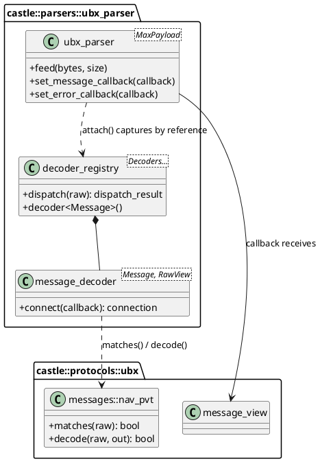
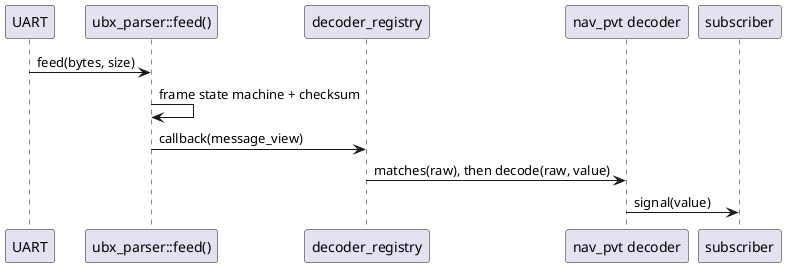

# UBX Protocol & ubx_parser

> **Target audience:** GNSS newcomers — developers new to location services who want to understand UBX binary protocol and quickly integrate the `ubx_parser` C++ library.

---

## Table of Contents

### Part 1 — UBX Protocol: Theory
1. [What is UBX Protocol?](#1-what-is-ubx-protocol)
2. [UBX Message Frame Structure](#2-ubx-message-frame-structure)
3. [Message Classes and IDs](#3-message-classes-and-ids)
4. [Payload Structure](#4-payload-structure)
5. [Checksum Algorithm — Fletcher-8](#5-checksum-algorithm--fletcher-8)
6. [Communication Interface Basics](#6-communication-interface-basics)
7. [Key Concepts Glossary](#7-key-concepts-glossary)

### Part 2 — ubx_parser Library: Developer Guide
8. [Library Overview](#8-library-overview)
9. [Architecture Overview](#9-architecture-overview)
10. [Quick Start: Parsing a Byte Stream](#10-quick-start-parsing-a-byte-stream)
11. [Streaming Input and View Lifetimes](#11-streaming-input-and-view-lifetimes)
12. [Typed Decoders and the Registry](#12-typed-decoders-and-the-registry)
13. [Decoding UBX Messages](#13-decoding-ubx-messages)
14. [Building UBX Messages](#14-building-ubx-messages)
15. [Errors, Counters, and Recovery](#15-errors-counters-and-recovery)
16. [Project Integration](#16-project-integration)
17. [Constraints and Common Mistakes](#17-constraints-and-common-mistakes)

---

---

# Part 1 — UBX Protocol: Theory

> This part is a beginner-friendly protocol reference. Read it first to understand what UBX is, why it exists, and how its messages are structured — before you write a single line of code.

---

## 1. What is UBX Protocol?

> The u-blox (UBX) protocol is a proprietary, binary, and compact communication protocol designed by u-blox to efficiently communicate with their GNSS/GPS receivers.

### The problem it solves

Imagine you have a tiny GNSS receiver soldered on a circuit board. It knows exact position, speed, and time — computed from satellite signals. Your computer needs that data.

But how does the chip talk to applications? It sends bytes over a wire (typically a UART serial port). Without a defined format, those bytes are just noise. **UBX is the agreed language** — a binary protocol that tells both sides exactly how each message is structured.

> **Analogy:** UBX is like an envelope standard for letters. Both the sender and receiver agree that every envelope has a stamp in the top-right corner, a return address, and a recipient address. Without the standard, no one could reliably open and read the mail.

### What UBX does

UBX messages have three roles:

1. **Output** — the GNSS chip periodically sends navigation data (position, velocity, time, satellite status) to host computer.
2. **Commands** — the host sends configuration commands to control the chip (e.g., "give me position at 10 Hz instead of 1 Hz").
3. **Acknowledgements** — after every command, the chip replies with `UBX-ACK-ACK` (accepted) or `UBX-ACK-NAK` (rejected), so you always know whether your command worked.

### UBX vs. NMEA — which should you use?

You may have heard of **NMEA 0183** — the text-based GPS protocol. Here is a direct comparison:

| Aspect | UBX | NMEA 0183 |
|---|---|---|
| Format | Binary | ASCII text (human-readable) |
| Primary purpose | Full receiver control + rich data output | Simple navigation sentences |
| Can configure the receiver | **Yes** — the only way on u-blox chips | No |
| Data richness | Very high (raw measurements, sensor fusion, diagnostics) | Low (position, speed, heading) |
| Parser complexity | Requires a binary state machine | Simple string splitting |
| Bandwidth efficiency | Compact binary | 3–4× larger than equivalent UBX |

**Use NMEA when:**
- Need quick human-readable output for debugging.
- A third-party tool only accepts NMEA.
- O`nly need basic latitude/longitude/speed.

**Use UBX when:**
- Need to configure the receiver (message rates, port settings, etc.).
- Need high-rate, high-precision data (carrier phase, IMU fusion, accuracy estimates).
- Need to write production software that must be efficient and deterministic.

> **Key takeaway:** On u-blox chips, configuration is **only possible through UBX**. NMEA is output-only. If we want to change anything on the chip, we must speak UBX.

---

## 2. UBX Message Frame Structure

### Every UBX message looks the same on the outside

No matter what data is inside, every UBX message follows the same byte layout.  Think of it like a universal shipping box: the outside always has the same labels, only the contents differ.

### Frame layout

```
Byte index:   0      1      2       3     4       5       6 … N+5   N+6    N+7
              ┌──────┬──────┬───────┬─────┬───────┬───────┬─────────┬──────┬──────┐
              │ 0xB5 │ 0x62 │ Class │  ID │ Len_L │ Len_H │ Payload │ CK_A │ CK_B │
              └──────┴──────┴───────┴─────┴───────┴───────┴─────────┴──────┴──────┘
               Sync1   Sync2  ──────── Header ──────────── ─ Payload ─  Checksum
```

Where `N` is the declared payload length in bytes.

### Field-by-field description

| Field | Size | Value | Purpose |
|---|---|---|---|
| **Sync Char 1** | 1 byte | Always `0xB5` | Marks the start of a UBX frame |
| **Sync Char 2** | 1 byte | Always `0x62` | Together with Sync 1, this two-byte sequence uniquely identifies UBX |
| **Class** | 1 byte | e.g. `0x01` | Message group (NAV, CFG, ACK, …) |
| **ID** | 1 byte | e.g. `0x07` | Specific message within the group |
| **Length** | 2 bytes | Little-endian U2 | Number of bytes in the payload (0 to 65 535) |
| **Payload** | 0–65 535 bytes | Message-specific | The actual data content |
| **CK_A** | 1 byte | Computed | First Fletcher-8 checksum byte |
| **CK_B** | 1 byte | Computed | Second Fletcher-8 checksum byte |

**Minimum frame size:** 8 bytes (zero-length payload — used for poll requests).  
**Overhead:** 8 bytes of framing around every payload.

### Real example: polling NAV-PVT (asking for a position fix)

A "poll request" asks the chip to send one NAV-PVT message immediately. It has **no payload** — just a header and checksum:

```
Byte:   0     1     2     3     4     5     6     7
      ┌─────┬─────┬─────┬─────┬─────┬─────┬─────┬─────┐
      │ B5  │ 62  │ 01  │ 07  │ 00  │ 00  │ 08  │ 19  │
      └─────┴─────┴─────┴─────┴─────┴─────┴─────┴─────┘
       Sync  Sync  NAV  PVT  Len=0  Len=0  CK_A  CK_B
```

- `0x01` = NAV class, `0x07` = PVT message ID
- `0x00 0x00` = zero-length payload (little-endian)
- `0x08 0x19` = computed checksum

---

## 3. Message Classes and IDs

### The class/ID naming system

Every UBX message is identified by a **two-byte pair: (Class, ID)**.

- **Class** = the module or topic area (like a chapter in a book)
- **ID** = the specific message within that chapter

For example, `UBX-NAV-PVT` means:
- Class `0x01` = NAV (navigation)
- ID `0x07` = PVT (Position, Velocity, Time)

### Common message classes

| Class Byte | Name | What it covers |
|---|---|---|
| `0x01` | **NAV** | Navigation results: position, velocity, time, satellite info |
| `0x02` | **RXM** | Receiver Manager: raw signal measurements |
| `0x04` | **INF** | Informational: human-readable debug/warning strings from the chip |
| `0x05` | **ACK** | Acknowledgements: confirms or rejects commands |
| `0x06` | **CFG** | Configuration: VALGET, VALSET, VALDEL, CFG-RST |
| `0x09` | **UPD** | Update / Save-on-Shutdown |
| `0x0A` | **MON** | Monitoring: hardware diagnostics, I/O stats, firmware version |
| `0x0D` | **TIM** | Timing: timepulse data |
| `0x10` | **ESF** | External Sensor Fusion: wheel tick, IMU, dead-reckoning |
| `0x27` | **SEC** | Security: jamming/spoofing detection |
| `0x29` | **NAV2** | Secondary navigation (dual-instance receivers) |

### Commonly used messages

| Message | Class | ID | Size | What it contains |
|---|---|---|---|---|
| **NAV-PVT** | `0x01` | `0x07` | 92 bytes | Position + Velocity + Time — the main navigation message |
| **NAV-SAT** | `0x01` | `0x35` | Variable | Per-satellite signal strength and health |
| **NAV-STATUS** | `0x01` | `0x03` | 16 bytes | Receiver navigation status and startup mode |
| **NAV-DOP** | `0x01` | `0x04` | 18 bytes | Dilution of Precision (HDOP, VDOP, etc.) |
| **NAV-TIMEUTC** | `0x01` | `0x21` | 20 bytes | UTC time solution |
| **NAV-CLOCK** | `0x01` | `0x22` | 20 bytes | Receiver clock bias and drift |
| **NAV-ATT** | `0x01` | `0x05` | 32 bytes | Vehicle attitude: roll, pitch, heading |
| **MON-VER** | `0x0A` | `0x04` | Variable | Firmware version and protocol version |
| **ACK-ACK** | `0x05` | `0x01` | 2 bytes | Command accepted |
| **ACK-NAK** | `0x05` | `0x00` | 2 bytes | Command rejected |
| **CFG-VALSET** | `0x06` | `0x8A` | Variable | Write configuration key-value pairs |
| **CFG-VALGET** | `0x06` | `0x8B` | Variable | Read configuration key-value pairs |

---

## 4. Payload Structure

### Reading the specification tables

The u-blox Interface Description document lists each message's payload in a table like this (example from NAV-PVT):

| Offset | Name | Type | Description |
|---|---|---|---|
| 0 | iTOW | U4 | GPS time of week [ms] |
| 4 | year | U2 | UTC year [1–9999] |
| 6 | month | U1 | UTC month [1–12] |
| 7 | day | U1 | UTC day [1–31] |
| 20 | fixType | U1 | GNSS fix type |
| 24 | lon | I4 | Longitude [1e-7 deg] |
| 28 | lat | I4 | Latitude [1e-7 deg] |

- **Offset** = byte position from the start of the payload (0 = first payload byte)
- **Type** = data type of the field (see table below)
- Reading fields means: go to `payload[offset]` and interpret the next `sizeof(type)` bytes

### UBX field types

| Type | Size | Meaning |
|---|---|---|
| `U1` | 1 byte | Unsigned 8-bit integer (0–255) |
| `U2` | 2 bytes | Unsigned 16-bit integer |
| `U4` | 4 bytes | Unsigned 32-bit integer |
| `U8` | 8 bytes | Unsigned 64-bit integer |
| `I1` | 1 byte | Signed 8-bit integer (−128 to +127) |
| `I2` | 2 bytes | Signed 16-bit integer |
| `I4` | 4 bytes | Signed 32-bit integer |
| `I8` | 8 bytes | Signed 64-bit integer |
| `X1` | 1 byte | 8-bit bitfield (use bit masks to extract individual flags) |
| `X2` | 2 bytes | 16-bit bitfield |
| `X4` | 4 bytes | 32-bit bitfield |
| `R4` | 4 bytes | IEEE 754 single-precision float |
| `R8` | 8 bytes | IEEE 754 double-precision float |
| `CH` | 1 byte | ASCII character |

### Little-endian byte order — the most important rule

All multi-byte values in UBX are stored **little-endian**: the **least significant byte comes first**.

> **Analogy:** Think of writing the number 1000 as "000 1" (units first, then thousands).

**Example — reading a U4 at offset 0 (e.g. iTOW = 400 000 ms):**

The 4 bytes on the wire:
```
payload[0] = 0x40
payload[1] = 0x1A
payload[2] = 0x06
payload[3] = 0x00
```

Reconstruct the value: `0x00` `0x06` `0x1A` `0x40` = **`0x00061A40`** = **400 000** ✓

**Correct C++ code:**
```cpp
uint32_t itow = static_cast<uint32_t>(payload[0])
              | (static_cast<uint32_t>(payload[1]) <<  8u)
              | (static_cast<uint32_t>(payload[2]) << 16u)
              | (static_cast<uint32_t>(payload[3]) << 24u);
```

**Wrong — do not do this:**
```cpp
// UNDEFINED BEHAVIOUR: alignment violation and strict aliasing violation
uint32_t itow = *reinterpret_cast<uint32_t*>(&payload[0]);
```

> **Warning:** Always use explicit shift-and-OR to read multi-byte fields. Never cast a raw pointer to a wider integer type.

### Scaling — fields are often integers with a scale factor

Many fields store a physical quantity as a scaled integer to avoid floating-point in the protocol:

| Field | Type | Raw value means | To get real value |
|---|---|---|---|
| `lat` | I4 | degrees × 10⁷ | divide by `1e7` |
| `lon` | I4 | degrees × 10⁷ | divide by `1e7` |
| `height` | I4 | millimetres | divide by `1000.0` for metres |
| `hAcc` | U4 | millimetres | divide by `1000.0` for metres |
| `headMot` | I4 | degrees × 10⁵ | divide by `1e5` |

---

## 5. Checksum Algorithm — Fletcher-8

### Why checksums matter

When bytes travel over a UART wire, electrical noise can flip a bit. A checksum is a quick mathematical test that catches most transmission errors. UBX uses a variant of the **Fletcher-8** algorithm.

### How it works

The checksum runs over every byte from the **Class byte** to the **last payload byte** (the sync bytes are excluded). It produces two output bytes: `CK_A` and `CK_B`.

**Algorithm:**
```
CK_A = 0
CK_B = 0
for each byte b in [Class, ID, Len_L, Len_H, Payload...]:
    CK_A = (CK_A + b) mod 256
    CK_B = (CK_B + CK_A) mod 256
```

Both values stay in the range 0–255 (one byte each). The "mod 256" part happens naturally if they are stored in `uint8_t` variables.

### Worked example — NAV-PVT poll frame

Bytes covered: `[0x01, 0x07, 0x00, 0x00]` (Class, ID, Len_L, Len_H — no payload)

| Step | Byte processed | CK_A | CK_B |
|---|---|---|---|
| Start | — | `0x00` | `0x00` |
| Class | `0x01` | `0x01` | `0x01` |
| ID | `0x07` | `0x08` | `0x09` |
| Len_L | `0x00` | `0x08` | `0x11` |
| Len_H | `0x00` | `0x08` | `0x19` |

**Result:** `CK_A = 0x08`, `CK_B = 0x19`  
Complete frame: `B5 62 01 07 00 00 08 19` ✓

### C++ implementation

```cpp
void compute_checksum(const uint8_t* data, std::size_t len,
                      uint8_t& ck_a, uint8_t& ck_b)
{
    ck_a = 0u;
    ck_b = 0u;
    for (std::size_t i = 0u; i < len; ++i)
    {
        ck_a = static_cast<uint8_t>(ck_a + data[i]);
        ck_b = static_cast<uint8_t>(ck_b + ck_a);
    }
}
// Call with: data = &frame[2] (start at Class byte), len = 4 + payload_length
```

### Common checksum mistakes

| Mistake | What goes wrong |
|---|---|
| Including the sync bytes (`0xB5 0x62`) in the checksum | Computed value never matches; every frame is rejected |
| Starting checksum at payload start (skipping Class/ID/Length) | Different messages with identical payloads would be confused |
| Using a 16-bit or 32-bit accumulator without truncating to 8 bits | Overflow produces wrong values |
| Only checking `CK_A` | Misses errors that cancel out in `CK_A` but not in `CK_B` |

---

## 6. Communication Interface Basics

### Physical interfaces

u-blox F9-class chips can communicate over four interfaces:

| Interface | Typical use case | Notes |
|---|---|---|
| **UART** | Automotive, embedded OEM boards | Full-duplex serial; most common; shares the wire with NMEA output |
| **USB** (CDC-ACM) | PC development, lab testing | Appears as a virtual COM port (`/dev/ttyACM0` on Linux) |
| **SPI** | High-speed embedded systems | Chip-select framed; requires periodic polling for incoming data |
| **I²C** | Low-speed microcontrollers | Register-based; slower; less common |

### Three interaction patterns

**Pattern 1 — Periodic output (chip → host)**

The chip sends navigation data at a regular rate you configure. Most messages are off by default (rate = 0) and you must enable them via `CFG-VALSET`.

```
Chip  ──►  UBX-NAV-PVT   (every 200 ms if rate = 5 Hz)
Chip  ──►  UBX-NAV-SAT   (every 1 s if rate = 1 Hz)
```

**Pattern 2 — Poll request / poll response (host → chip → host)**

Your host sends an empty frame (zero payload) with the Class/ID of the message it wants. The chip replies immediately with one instance.

```
Host  ──►  B5 62 01 07 00 00 08 19        (poll NAV-PVT)
Chip  ◄──  B5 62 01 07 5C 00 [92 bytes] [CK_A] [CK_B]   (NAV-PVT response)
```

**Pattern 3 — Command + ACK/NAK (host → chip → host)**

Your host sends a configuration command. The chip confirms or rejects with a 2-byte ACK payload that echoes back the Class and ID of your command.

```
Host  ──►  UBX-CFG-VALSET  (set measurement rate = 200 ms)
Chip  ◄──  UBX-ACK-ACK     (payload: 0x06 0x8A — echoes CFG-VALSET class/id)
```

> **Warning:** Always wait for `ACK-ACK` before sending the next command. If you receive `ACK-NAK`, the command was **rejected** — check the key ID and value format.

### Configuration with VALSET/VALGET (F9-class chips)

F9-class chips use a **key-value** configuration model. Every setting has a 32-bit key ID.

| Command | Direction | What it does |
|---|---|---|
| **CFG-VALGET** (class `0x06`, ID `0x8B`) | Host → chip → host | Read the current value of a key |
| **CFG-VALSET** (class `0x06`, ID `0x8A`) | Host → chip | Write a new value to a key |
| **CFG-VALDEL** (class `0x06`, ID `0x8C`) | Host → chip | Reset a key to its firmware default |

**Configuration layers** (each key-value lives in a stack):

| Layer | Lifetime |
|---|---|
| **RAM** | Lost on power cycle or software reset |
| **BBR** (Battery-Backed RAM) | Survives software reset; lost when power is fully removed |
| **Flash** | Truly permanent; survives power loss |

**Example — enable NAV-PVT at 5 Hz:**
1. Key ID for `CFG-MSGOUT-UBX_NAV_PVT_UART1` = output rate on UART1 port.
2. Build a VALSET frame with that key set to `1` (once per epoch), targeting RAM layer.
3. Send it; wait for `ACK-ACK`.
4. Separately, set `CFG-RATE-MEAS` (key `0x30210001`) to `200` (200 ms = 5 Hz).

---

## 7. Key Concepts Glossary

| Term | Definition |
|---|---|
| **GNSS** | Global Navigation Satellite System — the generic term for all satellite positioning systems: GPS (USA), GLONASS (Russia), Galileo (EU), BeiDou (China). A receiver determines position by measuring signal travel times from multiple satellites. |
| **UBX** | The proprietary binary protocol used by u-blox GNSS chips for all host↔receiver communication. |
| **NMEA** | A text-based GPS output protocol (`$GNRMC`, `$GNGGA`, etc.). Output-only; cannot configure a u-blox receiver. |
| **RTCM** | A binary correction data protocol for RTK (high-precision) positioning. Not used for receiver configuration. |
| **Epoch** | One complete navigation computation cycle. All messages from the same computation share the same iTOW value. |
| **iTOW** | GPS Time Of Week — the timestamp for navigation data, in milliseconds since the start of the current GPS week. |
| **Fix** | A successful position computation. A fix is only usable when the `gnssFixOK` flag is set in NAV-PVT. |
| **PVT** | Position, Velocity, Time — the canonical combined GNSS output. `UBX-NAV-PVT` is the primary message. |
| **Payload** | The data content of a UBX frame, not including sync bytes, header, or checksum. |
| **Little-endian** | Byte order where the least significant byte is stored first. All multi-byte UBX integers use this order. |
| **CK_A / CK_B** | Two-byte Fletcher-8 checksum appended to every UBX frame to detect transmission errors. |
| **Poll** | A zero-payload UBX frame sent to request an immediate one-shot response from the chip. |
| **ACK / NAK** | Acknowledgement (success) / Negative Acknowledgement (rejected) sent after every command. |
| **VALSET / VALGET** | The F9-generation key-value configuration interface for writing/reading chip settings. |
| **BBR** | Battery-Backed RAM — chip memory that survives software resets but not full power loss. |
| **SV** | Space Vehicle — the formal name for a GNSS satellite. |
| **CNO** | Carrier-to-Noise density ratio — a measure of signal strength for a satellite, in dB-Hz. |

---

---

# Part 2 — ubx_parser Library: Developer Guide

> This guide describes the current Castle implementation. It replaces the older registry/dispatcher/database/config-manager API described in earlier versions of this document. Part 1 above remains the protocol reference; this part explains the library boundaries and how to use them from an application.

---

## 8. Library Overview

### Three layers, one data path

Castle keeps UBX framing separate from stream handling and from message-specific decoding:

| Layer | Header | Responsibility |
|---|---|---|
| Protocol primitives | `castle_ext/protocols/ubx/ubx.hpp` | UBX constants, checksum, validated `message_view`, and caller-buffer `encode_frame()` / `decode_frame()` functions. It does not depend on the parser. |
| Protocol extensions | `castle_ext/protocols/ubx/payload_reader.hpp`, `ubx_config.hpp`, and `messages/*.hpp` | Safe little-endian payload reading, CFG-VALSET/VALGET helpers, and typed message decoders. `messages/messages.hpp` is the typed-message umbrella. |
| Stream parser | `castle_ext/parsers/ubx_parser/ubx_parser.hpp` | Fixed-storage byte-stream state machine. It validates a complete frame and reports a non-owning `message_view` synchronously. |
| Optional decoder registry | `castle_ext/parsers/ubx_parser/decoder_registry.hpp` | Adapts typed message decoders to the UBX raw view and provides compile-time fan-out to subscribers. |

The parser does not automatically decode NAV-PVT or maintain a location database. Use the raw callback and protocol helpers for a small integration, or add the typed decoders and registry when several message types need separate subscribers. Transport, scheduling, logging, thread synchronization, and receiver command policy belong to the application.

The implementation is header-only and uses fixed-capacity Castle containers and callback wrappers. The parser and registry do not allocate memory for incoming frames or subscribers. The parser is non-copyable, non-movable, single-threaded, and non-reentrant.

---

## 9. Architecture Overview

### Receive path

```text
UART / DMA byte buffer
        |
        v
ubx_parser::feed()
  sync -> header -> payload -> checksum
        |
        | checksum-valid frame
        v
protocols::ubx::message_view
        |
        +---- direct parser callback (raw class, ID, payload)
        |
        +---- optional decoder_registry::dispatch()
                    |
                    +-- matching message::decode(raw, value)
                    +-- signal emits const typed value to subscribers
```

The protocol header owns framing knowledge (sync bytes, frame offsets, checksum, endian helpers). The parser reuses the protocol checksum accumulator as bytes arrive. Typed message structures implement static `matches(const message_view&)` and `decode(const message_view&, Message&)`. The registry composes those types without virtual dispatch or a runtime list of decoder objects.

### Registry class diagram



### Sequence for one typed message



Without `attach()`, the parser can call an application callback directly. `attach()` installs a callback that captures the registry by reference; it replaces any message callback already installed on that parser. The error callback is a separate slot and is unaffected.

---

## 10. Quick Start: Parsing a Byte Stream

Include the parser and protocol headers. The parser accepts any contiguous UART/DMA chunk; it handles partial frames and more than one frame per call.

```cpp
#include "castle_ext/parsers/ubx_parser/ubx_parser.hpp"
#include "castle_ext/protocols/ubx/ubx.hpp"

using castle::parsers::ubx_parser::parse_error;
using castle::parsers::ubx_parser::ubx_parser;
using namespace castle::protocols::ubx;

ubx_parser<> parser;

parser.set_message_callback(
    [](const message_view& message)
    {
        if (message.is(UBX_CLASS_NAV, UBX_ID_NAV_PVT))
        {
            // This is the raw PVT payload. Decode it here, or use a typed decoder.
            const castle::size_type payload_bytes = message.payload_length();
            (void)payload_bytes;
        }
    });

parser.set_error_callback(
    [](const parse_error& error)
    {
        // Map error.code to a log or transport diagnostic as appropriate.
        (void)castle::parsers::ubx_parser::error_message(error.code);
    });

// In the UART/DMA receive path, feed exactly the bytes received:
// parser.feed(rx_bytes, rx_count);
```

A valid frame is delivered synchronously before `feed()` returns. This code only frames and checks the payload; a callback that needs actual PVT fields must decode them (see Sections 12–13).

---

## 11. Streaming Input and View Lifetimes

### Fixed-capacity parser

```cpp
castle::parsers::ubx_parser::ubx_parser<4096U> parser;
```

`MaxPayload` defaults to `UBX_SAFE_MAX_PAYLOAD_LEN` (4096 bytes), must be greater than zero, and cannot exceed the 16-bit UBX length field. It is a compile-time storage choice, not a run-time setting. No frame-sized heap allocation is performed.

The `feed()` overloads accept one `uint8_t`, a `(const uint8_t*, size)` range, or `castle::container::array_view<const uint8_t>`. Calls may split a frame at any byte boundary or contain several frames. Bytes other than the expected sync sequence are ignored while searching for a frame; malformed or checksum-invalid frames are reported through the error callback.

The parser states are `wait_sync_1`, `wait_sync_2`, `wait_class`, `wait_id`, `wait_length_low`, `wait_length_high`, `read_payload`, `wait_checksum_a`, and `wait_checksum_b`. A payload length larger than the configured capacity is discarded as soon as its two length bytes have arrived.

### Do not retain the raw view

`message_view::payload` aliases the parser's internal fixed payload array. Treat the view as valid only during the callback; do not save the view or its payload pointer for later use. Copy the needed values into application-owned storage before returning. The parser is not thread-safe or re-entrant: one thread should own it, and callbacks must not call `feed()` recursively.

`reset()` returns the state machine to idle and clears `frames_decoded()` and `frames_discarded()`, but keeps both callbacks installed. `state()`, `payload_size()`, `payload_capacity()`, and the two frame counters are available for diagnostics.

---

## 12. Typed Decoders and the Registry

The typed layer is optional. Each message type supplies `matches(const message_view&)` and `decode(const message_view&, Message&)`. `message_decoder` calls those functions and emits a typed value only when decoding succeeds. `decoder_registry` stores a fixed compile-time list of decoders and checks each decoder for every valid frame; more than one decoder may match the same frame.

Here is a small registry with only NAV-PVT. Declare the registry before the parser so the registry outlives the parser callback, and keep the returned subscription handle alive while notifications are wanted:

```cpp
#include "castle_ext/parsers/ubx_parser/ubx_parser.hpp"
#include "castle_ext/parsers/ubx_parser/decoder_registry.hpp"

using castle::protocols::ubx::messages::nav_pvt;
using castle::parsers::ubx_parser::decoder_registry;
using castle::parsers::ubx_parser::nav_pvt_decoder;
using castle::parsers::ubx_parser::ubx_parser;

// Destruction is reverse declaration order: parser is destroyed before registry.
decoder_registry<nav_pvt_decoder<>> registry;
ubx_parser<> parser;

auto pvt_subscription = registry.decoder<nav_pvt>().connect(
    [](const nav_pvt& pvt)
    {
        if (pvt.fix_ok())
        {
            // Latitude/longitude are converted to decimal degrees by accessors.
            const double latitude = pvt.latitude_deg();
            const double longitude = pvt.longitude_deg();
            (void)latitude;
            (void)longitude;
        }
    });

castle::parsers::ubx_parser::attach(parser, registry);

// In the receive path: parser.feed(rx_bytes, rx_count);
```

`connect()` returns a move-only RAII connection. Destroying it disconnects the subscriber, so keep it in a named variable. A `message_decoder` has one subscriber by default; increase its `MaxSubscribers` template argument when required. The callback receives a reference to a decoded value that is local to the dispatch operation. Copy fields that must outlive the callback. The registry and parser are non-copyable and non-movable.

For an application that wants every built-in decoder, use `default_decoder_registry<>` instead of specifying the decoder pack. The protocol-specific `decoder_registry.hpp` facade includes `messages/messages.hpp`; use a custom `decoder_registry<...>` when you want a smaller compile-time set. `attach()` captures the registry by reference, so registry lifetime must extend beyond parser use. It replaces the parser's message callback, but leaves its error callback alone.

---

## 13. Decoding UBX Messages

### Built-in typed messages

The default registry currently provides decoders for the following message types:

| UBX class | Built-in message types |
|---|---|
| ACK | ACK-ACK, ACK-NAK |
| CFG | CFG-VALGET response |
| ESF | ESF-INS, ESF-MEAS, ESF-STATUS |
| INF | INF-ERROR, INF-WARNING, INF-NOTICE, INF-TEST, INF-DEBUG |
| MON | MON-IO, MON-SPAN, MON-TXBUF, MON-VER |
| NAV | NAV-ATT, NAV-CLOCK, NAV-DOP, NAV-EELL, NAV-ODO, NAV-PVT, NAV-SAT, NAV-SIG, NAV-STATUS, NAV-TIMEGPS, NAV-TIMEUTC |
| NAV2 | NAV2-DOP, NAV2-EELL, NAV2-PVT, NAV2-TIMEGPS |
| RXM | RXM-MEASX |
| SEC | SEC-CRC, SEC-SIG |
| TIM | TIM-TP |
| UPD | UPD-SOS output |

These are typed decoders, not merely message-ID constants. The message header files under `castle_ext/protocols/ubx/messages/` define the supported structs; `messages/messages.hpp` includes the set. The list is what the current default decoder registry exposes, not a promise that every UBX specification message has a typed decoder.

### Safe payload access

For an individual raw message, use Castle's endian helpers or the sequential `payload_reader`; do not cast the payload pointer to a packed C++ struct. `payload_reader` bounds-checks each read and latches failure. A decoder can read fields in protocol order and check `reader.ok()` once at the end.

For example, NAV-PVT has a fixed 92-byte payload. Its typed struct exposes raw integer fields and convenience scaling methods:

```cpp
if (nav_pvt::decode(message, pvt))
{
    if (pvt.fix_ok())
    {
        const double latitude = pvt.latitude_deg();  // raw I4 x 1e-7
        const double height_m = pvt.height_m();       // raw millimetres -> metres
    }
}
```

`decode_frame()` is the one-shot alternative when the application already has a complete frame: it checks sync, exact frame size, and checksum, then returns a `message_view` into the caller's frame buffer. The view has the same non-owning lifetime rule as the streaming parser's view.

---

## 14. Building UBX Messages

### Encode a frame

`encode_frame()` writes the complete frame, including sync, little-endian payload length, and checksum, into a caller-provided buffer. It returns `castle::status` and sets `bytes_written` to zero on failure. `decode_frame()` can validate the resulting bytes when working with complete-frame buffers.

### Build a CFG-VALSET request

CFG helpers are protocol utilities in `ubx_config.hpp`; they do not open a serial port, wait for an ACK, or manage a configuration transaction. The application sends the returned bytes and handles the receiver's ACK/NAK itself.

```cpp
#include "castle_ext/protocols/ubx/ubx_config.hpp"

using namespace castle::protocols::ubx;
using namespace castle::protocols::ubx::config;

config_entry entries[1U] = {
    {0x30210001U, config_value(static_cast<uint16_t>(1000U))} // CFG-RATE-MEAS
};
uint8_t frame[64U];
castle::size_type written = 0U;

castle::status result = build_valset_frame(
    castle::container::array_view<const config_entry>(entries, 1U),
    static_cast<uint8_t>(config_layer::ram),
    frame, sizeof(frame), written);

if (castle::succeeded(result))
{
    // Write frame[0..written) to the receiver, then process ACK-ACK / ACK-NAK.
}
```

`build_valget_frame()` creates a poll for one or more key IDs, and `parse_valget_response()` decodes response entries into caller-provided storage. Configuration keys are specified by u-blox; `value_byte_size()` derives the wire width from each key's size code.

---

## 15. Errors, Counters, and Recovery

Install an error callback when diagnostics matter:

```cpp
parser.set_error_callback(
    [](const castle::parsers::ubx_parser::parse_error& error)
    {
        // error.code, msg_class, msg_id, and payload_length are numeric fields.
        (void)castle::parsers::ubx_parser::error_message(error.code);
    });
```

| Error | Meaning |
|---|---|
| `payload_too_large` | Declared payload exceeds this parser's `MaxPayload`. |
| `checksum_mismatch` | The calculated Fletcher-8 pair differs from the received pair. |
| `invalid_argument` | A null input pointer was supplied with a non-zero size. |
| `invalid_sync` | Defensive recovery for an invalid internal state; ordinary noise/bad sync bytes are silently skipped. |

An emitted error increments `frames_discarded()` and resets frame parsing to the sync search state. The parser does not need an application `reset()` after a corrupt frame. Counters are `castle::size_type`; `reset()` clears them as well as the partial-frame state, while retaining callbacks. `error_message(code)` returns stable text without allocating.

---

## 16. Project Integration

Castle is a C++17 header-only library. Add the repository `include/` directory to the target include path and include only the layers the application uses:

```cpp
#include "castle_ext/protocols/ubx/ubx.hpp"                    // frame helpers
#include "castle_ext/parsers/ubx_parser/ubx_parser.hpp"         // stream parser
#include "castle_ext/parsers/ubx_parser/decoder_registry.hpp"   // optional typed dispatch
#include "castle_ext/protocols/ubx/ubx_config.hpp"              // optional CFG helpers
```

The parser sample files are `samples/castle_ext/parsers/ubx_parser/ubx_parser.cpp` and `decoder_registry.cpp`. Configure and build one sample target from the repository root:

```sh
cmake -S . -B build_samples -DCMAKE_BUILD_TYPE=Debug -DCASTLE_BUILD_SAMPLES=ON
cmake --build build_samples --target castle_ext_parsers_ubx_parser_decoder_registry
```

The raw-parser target is `castle_ext_parsers_ubx_parser_ubx_parser`. The examples demonstrate byte-at-a-time and chunked input, error reporting, and typed registry dispatch.

---

## 17. Constraints and Common Mistakes

- Do not retain `message_view` or its payload pointer after the callback. Decode or copy the required data during the callback.
- Do not call `feed()` concurrently or recursively. The parser is single-threaded and non-reentrant; publish copied application data through your own queue or synchronization mechanism if another thread needs it.
- Do not discard the value returned by `connect()`. Its destructor unsubscribes the callback.
- Keep the registry alive while the parser's attached callback may run. Declare the registry before the parser, or explicitly replace/clear the parser callback before registry destruction.
- `attach()` replaces the raw message callback. Choose either direct raw processing or registry dispatch for that callback; set the error callback independently.
- Typed message structs are values, but subscribers receive them by `const&` during synchronous dispatch. Copy what must persist. Variable-size decoders may use bounded template capacities, so select those capacities deliberately.
- The parser validates framing and checksum, not the semantics of every message. A checksum-valid frame can still have a payload rejected by its typed decoder; direct `dispatch()` reports this as `decoded < matched`.
- A valid zero-payload poll frame is not a NAV-PVT position response. The receiver's reply contains the NAV-PVT payload.
