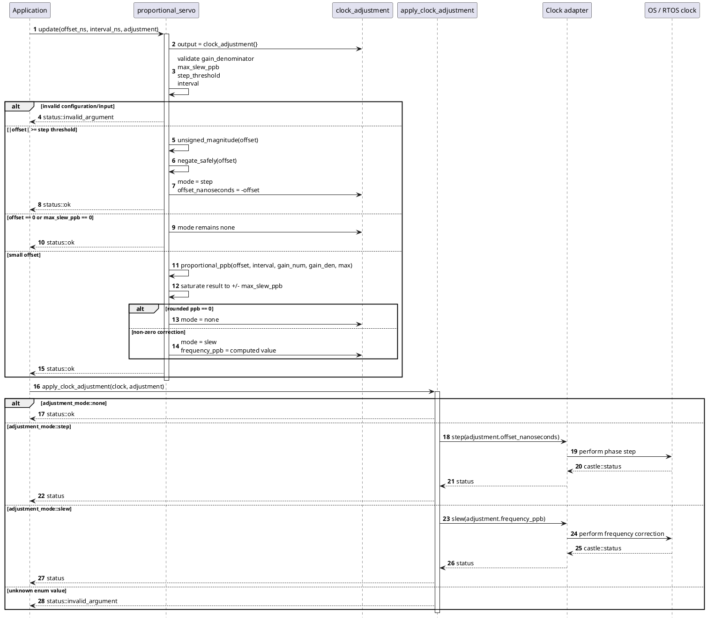
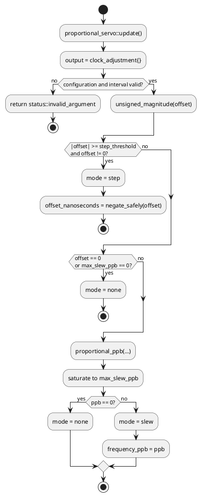

# PtpServo

## Overview
`castle::timing::ptp::proportional_servo` converts a measured PTP phase offset into a deterministic clock action. A large phase error produces a step request; a smaller error produces a bounded proportional frequency correction in parts per billion (ppb).

The servo is intentionally stateless. It does not own a timer, store historical samples, or invoke an operating-system API. That makes it suitable for embedded Linux, Zephyr, and RTOS integrations where the platform clock service is supplied by the application.

## Header
`#include "castle_ext/protocols/timing/ptp_servo.hpp"`

## Dependencies
- [`castle/core/compiler.hpp`](../../../../include/castle/core/compiler.hpp) — Castle portability macros.
- [`castle/error/status.hpp`](../../../../include/castle/error/status.hpp) — deterministic status values.

## Public API

| API | Purpose | Complexity |
|---|---|---|
| `adjustment_mode` | Selects `none`, `step`, or `slew`. | O(1) |
| `clock_adjustment` | Output action: phase step in ns or frequency correction in ppb. | O(1) |
| `servo_config` | Step threshold, slew limit, and proportional gain. | O(1) |
| `proportional_servo` | Stateless fixed-point servo policy. | O(1) |
| `proportional_servo::configure()` | Replaces the active policy configuration. | O(1) |
| `proportional_servo::config()` | Returns the current configuration. | O(1) |
| `proportional_servo::update()` | Converts one offset sample into a bounded action. | O(1) |
| `apply_clock_adjustment()` | Invokes the caller-supplied `step()` or `slew()` adapter method. | O(1) plus adapter cost |

## Usage Example

The matching sample is [`samples/castle_ext/protocols/timing/ptp_servo.cpp`](../../../../samples/castle_ext/protocols/timing/ptp_servo.cpp):

```cpp
castle::timing::ptp::proportional_servo servo;
castle::timing::ptp::clock_adjustment adjustment{};

castle::timing::ptp::servo_config config{};
config.step_threshold_nanoseconds = 250000000LL;
servo.configure(config);

castle::status status = servo.update(
    500000000LL,
    1000000000ULL,
    adjustment);

assert(status == castle::status::ok);
assert(adjustment.mode == castle::timing::ptp::adjustment_mode::step);
```

`step_threshold_nanoseconds` is the absolute offset boundary. An offset at or
above the configured value produces a step; a smaller non-zero offset produces
a proportional slew, subject to `max_slew_ppb`. The threshold can also be
provided through the `proportional_servo` constructor:

```cpp
castle::timing::ptp::servo_config config{};
config.step_threshold_nanoseconds = 250000000LL;
castle::timing::ptp::proportional_servo servo(config);
```

The application then applies the action to its platform clock adapter:

```cpp
status = castle::timing::ptp::apply_clock_adjustment(clock, adjustment);
assert(status == castle::status::ok);
```

On non-Zephyr POSIX builds using the GCC-compatible chrono backend, the built-in
`castle::chrono::system_clock_adapter` maps `step()` to `clock_gettime()` plus
`clock_settime(CLOCK_REALTIME, ...)`, and maps `slew()` to
`clock_adjtime(CLOCK_REALTIME, ...)` with `ADJ_FREQUENCY`. It converts the
servo's frequency correction from ppb to Linux's scaled-ppm `timex::freq`
unit. The process must have the platform privilege required to adjust the
system clock.

On Zephyr builds, the same adapter API delegates adjustments to a caller-supplied
`precision_clock` from `<zephyr/precision_timing/precision_clock.h>`:

```cpp
#include "castle/chrono/clock_variants/gcc_clock_variant.hpp"

precision_clock const& clock = /* initialized Zephyr precision clock */;
castle::chrono::system_clock_adapter adapter(clock);

castle::status status = castle::timing::ptp::apply_clock_adjustment(adapter, adjustment);
assert(status == castle::status::ok);
```

`step()` calls `precision_clock_adjust_phase()` with the nanosecond phase
offset. `slew()` converts integer ppb to Zephyr's signed 16.16 scaled-ppm
rate representation and calls `precision_clock_adjust_rate()`. The adapter
does not call Zephyr's floating-point `precision_clock_ppb_to_scaled_ppm()`;
the conversion remains deterministic and compatible with CASTLE's no-floating-
point core policy. An unconfigured adapter returns `status::not_configured`.

The adapter's time-read methods have independent source selection. They use
POSIX `clock_gettime()` whenever `CASTLE_USING_POSIX_APIS` is `1`, including on
Zephyr targets. Otherwise, Zephyr uses `precision_clock_read()` with the
configured `CASTLE_CHRONO_ZEPHYR_SYSTEM_PRECISION_CLOCK` and
`CASTLE_CHRONO_ZEPHYR_STEADY_PRECISION_CLOCK` expressions.

The adapter only needs these two operations:

```cpp
castle::status step(int64_t offset_nanoseconds) noexcept;
castle::status slew(int32_t frequency_ppb) noexcept;
```

## Constraints & Notes

- No heap, exceptions, RTTI, STL, virtual functions, or background work.
- No floating-point arithmetic is required by the servo.
- The default policy steps offsets at or above 100 ms and slews smaller offsets with a 1/8 proportional gain, capped at 500000 ppb.
- `correction_interval_nanoseconds` must be non-zero because it defines the interval over which the frequency correction is estimated.
- A positive input offset means the local clock is ahead of the master. Therefore the proportional frequency correction is negative: the local clock should run slower.
- A step action stores the amount that must be added to the local clock. Consequently a positive measured offset produces a negative step.
- `max_slew_ppb` must be non-negative. `gain_denominator` must be non-zero. A non-positive step threshold is rejected except that zero means every non-zero offset is eligible for a step, subject to input/config validation.
- When the requested proportional correction rounds to zero, the servo returns `adjustment_mode::none` rather than issuing a meaningless zero-rate slew.
- The GCC/Clang implementation uses a widened integer intermediate (`__int128`) when the compiler exposes it, avoiding floating-point behavior and preserving deterministic fixed-point arithmetic.
- The fallback implementation used on compilers without a widened integer type is intentionally conservative and should be treated as a portability fallback rather than a precision-matched implementation.

## Algorithm Details

For a measured local-minus-master offset `e` and correction interval `T`, the intended proportional frequency correction is:

```text
frequency_ppb = -(e / T) * 1e9 * gain_numerator / gain_denominator
```

The result is saturated to `[-max_slew_ppb, +max_slew_ppb]`.

The decision sequence is deterministic:

```text
                 +---------------------------+
                 | |offset| >= step threshold?
                 +-------------+-------------+
                               |
                     yes       |       no
                      v        |        v
                    STEP       |     offset == 0?
                               |          |
                               |    yes   |   no
                               |     v    |    v
                               |   NONE   |  PROPORTIONAL
                               |          |   SLEW + SATURATE
```

The servo intentionally does not attempt to estimate oscillator drift or remove steady-state error with integral history. A PI/PID controller can be implemented above this component if the application requires long-term oscillator discipline.

## Detailed Sequence Diagram

The servo call path is intentionally small and deterministic. `update()` validates the policy and input, chooses step versus slew, and computes a signed bounded action. `apply_clock_adjustment()` then performs compile-time dispatch to the caller's clock adapter.



### Servo decision path



## Platform Integration

`apply_clock_adjustment()` uses a compile-time interface rather than a virtual base class. A platform adapter can therefore wrap a native clock API while keeping the Castle timing code free of operating-system dependencies.

Typical platform mapping is:

- Embedded Linux: step using `clock_settime()` and slew using `clock_adjtime()` or a PHC/discipline-specific clock API.
- Zephyr: `system_clock_adapter` maps phase and frequency operations to the
  Zephyr `precision_clock_adjust_phase()` and `precision_clock_adjust_rate()`
  APIs.
- Other RTOS: implement the same two small adapter methods around the system's clock discipline service.

The adapter is also the right place to normalize `timespec` fields, handle syscall errors, and enforce any platform-specific rate limits.
