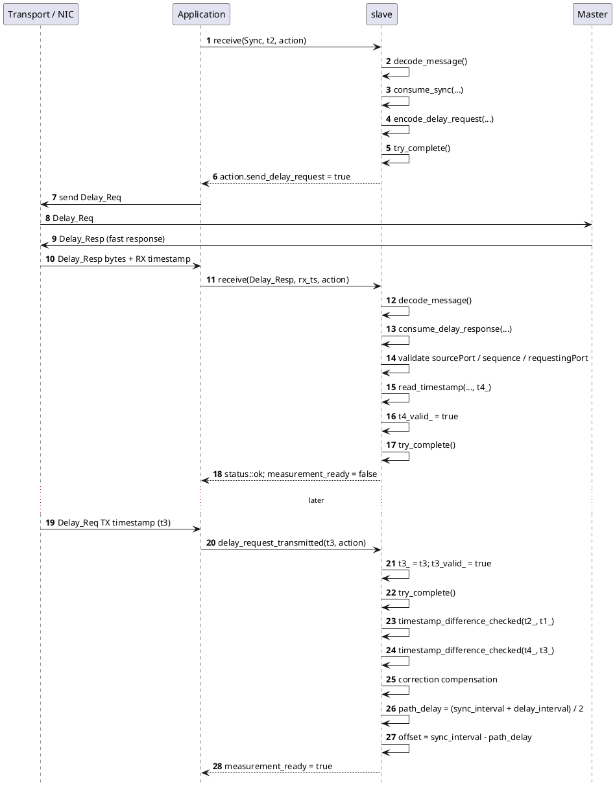
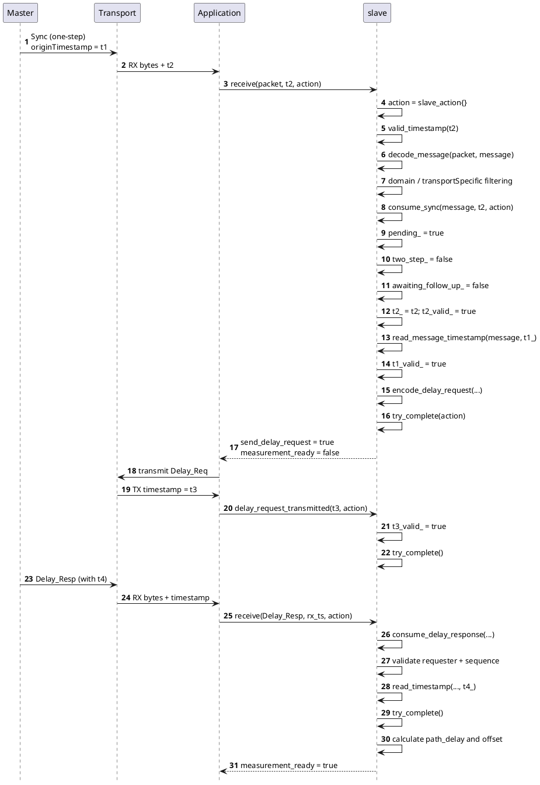
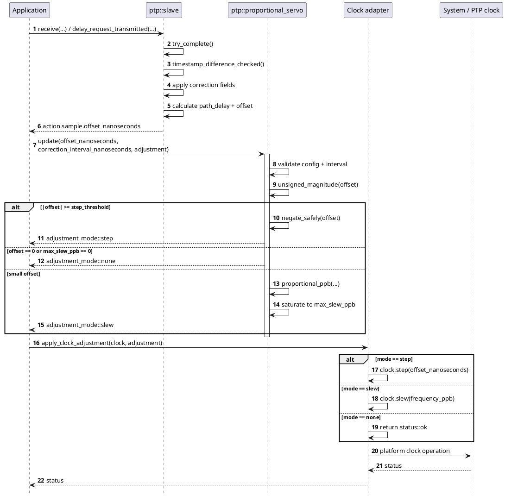

# PtpV2

## Overview
`castle::timing::ptp` is a fixed-storage, transport-neutral IEEE 1588 PTPv2 end-to-end slave engine. It parses PTP event/general messages, correlates a Sync/Follow_Up/Delay_Resp exchange, emits a bounded Delay_Req frame, and calculates clock offset and path delay.

The component deliberately does not open sockets, own DMA buffers, select a network interface, spawn a thread, or change the operating-system clock. A platform adapter supplies RX/TX timestamps and transmits the returned buffer. This keeps the same protocol state machine usable with embedded Linux, Zephyr, and other RTOS network stacks.

The implemented exchange is:

```text
Master                         Slave
  |                               |
  | -------- Sync --------------> |  t2 = RX timestamp
  | -------- Follow_Up ---------> |  t1 = precise master timestamp (two-step)
  | <------- Delay_Req ---------- |  t3 = TX timestamp
  | -------- Delay_Resp --------> |  t4 = precise master RX timestamp
  |                               |
```

Both one-step Sync and two-step Sync are supported. Announce/BMCA, peer-to-peer delay, profile TLVs, transport framing, and master selection are intentionally outside this core component.

## Header
`#include "castle_ext/protocols/timing/ptp_v2.hpp"`

## Dependencies
- [`castle/core/compiler.hpp`](../../../../include/castle/core/compiler.hpp) — Castle compiler/attribute portability macros.
- [`castle/core/types.hpp`](../../../../include/castle/core/types.hpp) — fixed Castle size types.
- [`castle/error/status.hpp`](../../../../include/castle/error/status.hpp) — deterministic error/status results.
- [`castle/container/array_view.hpp`](../../../../include/castle/container/array_view.hpp) — non-owning packet views.

## Public API

| API | Purpose | Complexity |
|---|---|---|
| `message_type` | Enumerates the PTP message types recognized by the decoder. | O(1) |
| `timestamp` | Host representation of the 48-bit-seconds/32-bit-nanoseconds PTP timestamp. | O(1) |
| `port_identity` | Eight-byte clock identity plus port number. | O(1) storage |
| `message_header` | Decoded common PTP header. `is_two_step()` checks the two-step flag. | O(1) |
| `message_view` | Non-owning decoded message view. | O(1) storage |
| `measurement` | Completed `t1..t4`, path delay, offset, and correction values. | O(1) storage |
| `slave_action` | Bounded output from `slave::receive()` and TX timestamp completion. | Fixed 44-byte buffer |
| `slave_config` | Domain, transport-specific nibble, and initial Delay_Req sequence. | O(1) |
| `valid_timestamp()` | Validates seconds and nanoseconds ranges. | O(1) |
| `same_port()` | Compares two PTP port identities. | O(1) fixed eight-byte comparison |
| `timestamp_difference()` | Returns signed nanoseconds for nearby timestamps. | O(1) |
| `timestamp_difference_checked()` | Checked variant which rejects `int64_t` overflow. | O(1) |
| `correction_to_nanoseconds()` | Converts the PTP 2^-16 ns correction field to whole nanoseconds. | O(1) |
| `decode_message()` | Validates and decodes the common PTP header without copying the payload. | O(1) |
| `read_message_timestamp()` | Reads a timestamp from Sync/Follow_Up/Delay_Resp payloads. | O(1) |
| `encode_delay_request()` | Builds a complete 44-byte Delay_Req into caller storage. | O(1) fixed 10-byte payload write |
| `slave::receive()` | Consumes a received packet and returns a bounded action/status. | O(1) |
| `slave::delay_request_transmitted()` | Supplies the Delay_Req TX timestamp and optionally completes the exchange. | O(1) |
| `slave::pending()` | Reports whether an exchange is outstanding. | O(1) |
| `slave::last_measurement()` | Returns the latest completed sample. | O(1) |
| `slave::reset()` | Clears in-flight exchange state while retaining configuration. | O(1) |

### Status behavior

`castle::status::ok` means the operation was accepted. `not_found` is used for packets that are valid PTP but do not belong to the current configured exchange. `invalid_argument` indicates malformed timestamps, unsupported payload shape, or invalid API input. `out_of_range` indicates arithmetic overflow during timestamp/correction calculations. `not_configured` means `delay_request_transmitted()` was called without an outstanding exchange.

## Usage Example

The matching sample is [`samples/castle_ext/protocols/timing/ptp_v2.cpp`](../../../../samples/castle_ext/protocols/timing/ptp_v2.cpp). The essential flow is:

```cpp
castle::timing::ptp::port_identity local{};
local.port_number = 2U;

castle::timing::ptp::slave slave(local);
castle::timing::ptp::slave_action action{};

castle::timing::ptp::timestamp rx_sync{100U, 200000000U};
castle::status status = slave.receive(
    castle::container::array_view<const uint8_t>(sync_packet, sync_size),
    rx_sync,
    action);

assert(status == castle::status::ok);
assert(action.send_delay_request);
```

After the transport sends the generated Delay_Req, feed its precise TX timestamp back through `delay_request_transmitted()`. Feed the Follow_Up and Delay_Resp packets through `receive()`. When all four timestamps are available, `action.measurement_ready` becomes `true` and `action.sample` contains the measured phase offset and path delay.

## Detailed Sequence Diagrams

The diagrams below follow the actual `castle::timing::ptp::slave` call graph in `ptp_v2.hpp`. They intentionally show the transport/OS boundary as application-owned components: Castle receives already-framed PTP bytes and a precise timestamp, and it returns bounded protocol work plus a measurement.

### Two-step PTPv2 exchange — normal completion order

In the normal two-step exchange, the slave receives `Sync`, emits `Delay_Req`, later receives `Follow_Up` and `Delay_Resp`, and receives the local `Delay_Req` TX timestamp from the transport. The exchange is completed by `try_complete()` only after `t1`, `t2`, `t3`, and `t4` are valid.

```plantuml
@startuml
hide footbox
autonumber 1

participant "Master\nPTP clock" as Master
participant "Transport / NIC\n(or socket / RTOS)" as Transport
participant "Application\nPTP adapter" as App
participant "castle::timing::ptp::slave" as Slave
participant "slave_action" as Action

== Sync reception ==
Master -> Transport: Sync (two-step)\nsequence_id = N
Transport -> App: RX bytes + t2
App -> Slave: receive(packet, t2, action)
activate Slave
Slave -> Slave: action = slave_action{}
Slave -> Slave: valid_timestamp(t2)
Slave -> Slave: decode_message(packet, message)
activate Slave
Slave -> Slave: frame-size / version / length checks
Slave -> Slave: detail::valid_message_type(type)
Slave -> Slave: decode header + sourcePort + sequenceId
Slave --> Slave: true
Deactivate Slave
Slave -> Slave: domain / transportSpecific filtering
Slave -> Slave: consume_sync(message, t2, action)
activate Slave
Slave -> Slave: pending_ = true
Slave -> Slave: two_step_ = message.header.is_two_step()
Slave -> Slave: awaiting_follow_up_ = true
Slave -> Slave: t2_ = t2; t2_valid_ = true
Slave -> Slave: master_ = sourcePort\nsequence_id_ = N
Slave -> Slave: correction_to_nanoseconds(header.correction_field)
Slave -> Slave: encode_delay_request(..., delay_sequence_id_, action.delay_request, ...)
activate Slave
Slave -> Slave: detail::encode_common_header(...)
Slave -> Slave: write_be16/32/64(...)
Slave -> Slave: copy_port(...)
Slave --> Slave: status::ok
Deactivate Slave
Slave -> Slave: try_complete(action)
Slave --> App: status::ok + action.send_delay_request=true
Deactivate Slave
App -> Transport: transmit(action.delay_request)

== Follow_Up reception ==
Master -> Transport: Follow_Up\nsequence_id = N\npreciseOriginTimestamp
Transport -> App: RX bytes + receive timestamp
App -> Slave: receive(packet, t2_followup, action)
activate Slave
Slave -> Slave: valid_timestamp(...)
Slave -> Slave: decode_message(...)
Slave -> Slave: domain / transportSpecific filtering
Slave -> Slave: consume_follow_up(message, action)
activate Slave
Slave -> Slave: pending_ && awaiting_follow_up_
Slave -> Slave: same_port(sourcePort, master_)
Slave -> Slave: sequence_id == sequence_id_
Slave -> Slave: read_message_timestamp(message, t1_)
Slave -> Slave: detail::read_timestamp(...)
Slave -> Slave: t1_valid_ = true
Slave -> Slave: awaiting_follow_up_ = false
Slave -> Slave: try_complete(action)
Slave --> Slave: not ready: t3_valid_ and/or t4_valid_ missing
Deactivate Slave
Slave --> App: status::ok; measurement_ready=false
Deactivate Slave

== Delay_Req TX timestamp ==
Transport -> App: TX timestamp for Delay_Req\n(t3)
App -> Slave: delay_request_transmitted(t3, action)
activate Slave
Slave -> Slave: action = slave_action{}
Slave -> Slave: pending_ == true
Slave -> Slave: valid_timestamp(t3)
Slave -> Slave: t3_ = t3; t3_valid_ = true
Slave -> Slave: try_complete(action)
Slave --> Slave: not ready: t4_valid_ missing
Slave --> App: status::ok; measurement_ready=false
Deactivate Slave

== Delay_Resp reception ==
Master -> Transport: Delay_Resp\nsequence_id = delay_sequence_id_\nrequestingPortIdentity = local_port
Transport -> App: RX bytes + receive timestamp
App -> Slave: receive(packet, t_rx, action)
activate Slave
Slave -> Slave: valid_timestamp(t_rx)
Slave -> Slave: decode_message(packet, message)
Slave -> Slave: domain / transportSpecific filtering
Slave -> Slave: consume_delay_response(message, action)
activate Slave
Slave -> Slave: pending_ && same_port(sourcePort, master_)
Slave -> Slave: sequence_id == delay_sequence_id_
Slave -> Slave: payload.size() >= 20
Slave -> Slave: parse requestingPortIdentity from payload[10..19]
Slave -> Slave: same_port(requestingPort, local_port_)
Slave -> Slave: detail::read_timestamp(payload.data(), t4_)
Slave -> Slave: t4_valid_ = true
Slave -> Slave: delay_correction_ = correction_to_nanoseconds(...)
Slave -> Slave: try_complete(action)
activate Slave
Slave -> Slave: timestamp_difference_checked(t2_, t1_, sync_interval)
Slave -> Slave: timestamp_difference_checked(t4_, t3_, delay_interval)
Slave -> Slave: sync_interval -= sync_correction_
Slave -> Slave: delay_interval -= delay_correction_
Slave -> Slave: total_path = sync_interval + delay_interval
Slave -> Slave: path_delay = total_path / 2
Slave -> Slave: offset = sync_interval - path_delay
Slave -> Slave: populate measurement sample
Slave -> Slave: last_measurement_ = sample
Slave -> Slave: action.measurement_ready = true
Slave -> Slave: action.sample = sample
Slave -> Slave: clear pending/timestamp-valid state
Slave --> Slave: status::ok
Deactivate Slave
Slave --> App: status::ok + measurement_ready=true + measurement
Deactivate Slave

@enduml
```



The critical architectural point is that `receive()` never transmits anything itself. `consume_sync()` prepares the fixed `Delay_Req` buffer, and the application decides how/when to transmit it and how to obtain the precise `t3` timestamp.

### Two-step exchange — `Delay_Resp` arrives before the TX timestamp

The implementation explicitly supports the race where the master replies before the network stack reports the local `Delay_Req` transmit timestamp. In that case `consume_delay_response()` stores `t4` and `try_complete()` returns `ok` without completing. Completion happens later inside `delay_request_transmitted()`.



### One-step Sync exchange

For one-step `Sync`, the precise origin timestamp is already in the first payload field. Therefore `consume_sync()` calls `read_message_timestamp()` immediately and marks `t1_valid_` without waiting for `Follow_Up`.



### From PTP measurement to clock correction

`ptp_v2::slave` deliberately stops at a measurement. The servo is a separate stateless component; this preserves the protocol/clock boundary and lets Linux, Zephyr, or another RTOS supply the actual clock operation.



### Function-level processing summary

```text
RX packet
  |
  +--> slave::receive()
        |
        +--> valid_timestamp()
        +--> decode_message()
        |     +--> detail::read_be16()
        |     +--> detail::valid_message_type()
        |     +--> parse header / source identity / sequence
        |
        +--> filter domain / transportSpecific
        |
        +--> message_type::sync
        |     +--> consume_sync()
        |           +--> read_message_timestamp()       [one-step only]
        |           +--> correction_to_nanoseconds()
        |           +--> encode_delay_request()
        |                 +--> detail::encode_common_header()
        |                       +--> write_be16/32/64()
        |                       +--> copy_port()
        |           +--> try_complete()
        |
        +--> message_type::follow_up
        |     +--> consume_follow_up()
        |           +--> same_port()
        |           +--> read_message_timestamp()
        |           +--> try_complete()
        |
        +--> message_type::delay_response
              +--> consume_delay_response()
                    +--> same_port()
                    +--> read requester identity
                    +--> detail::read_timestamp()
                    +--> correction_to_nanoseconds()
                    +--> try_complete()
                          +--> timestamp_difference_checked(t2, t1)
                          +--> timestamp_difference_checked(t4, t3)
                          +--> subtract correction fields
                          +--> path_delay = (sync + delay) / 2
                          +--> offset = sync - path_delay
                          +--> publish measurement

TX timestamp callback
  |
  +--> slave::delay_request_transmitted()
        +--> valid_timestamp()
        +--> store t3
        +--> try_complete()
```

## Constraints & Notes

- No dynamic allocation, exceptions, RTTI, virtual functions, STL dependency, or background processing is used.
- The slave owns only fixed-size state and a fixed 44-byte Delay_Req output buffer.
- Packet input is a non-owning `array_view`; the caller retains ownership and must keep it valid for the duration of `receive()`.
- Ethernet and UDP headers are outside the component. The input begins at the PTP message header.
- PTP version 2 is required. The implementation is intentionally scoped to the ordinary IEEE 1588 PTPv2 end-to-end exchange rather than attempting to implement every profile or revision feature.
- `transport_specific` can be matched exactly or configured as `PTP_ANY_TRANSPORT_SPECIFIC` to accept any four-bit transport-specific value. Profile semantics beyond that nibble are outside this core.
- One outstanding Sync-to-Delay_Resp exchange is tracked. A new matching Sync restarts the previous exchange.
- Delay_Resp is correlated using the master port identity and the Delay_Req sequence ID. The requesting-port identity in the Delay_Resp payload must match the configured local port.
- The Delay_Req origin timestamp is zero. The actual `t3` value must come from the transport timestamping boundary.
- Follow_Up and Delay_Resp may arrive before the corresponding TX timestamp callback. The state machine retains the partial exchange until the missing timestamp is supplied.
- `timestamp_difference()` is intended for nearby exchange timestamps. Use `timestamp_difference_checked()` when arbitrary or untrusted timestamp ranges can reach the API.
- Correction-field conversion truncates the fixed-point PTP correction to whole nanoseconds. The original fixed-point value remains available in the decoded header.

### Delay/offset equations

For the ordinary end-to-end exchange, after converting PTP correction fields to nanoseconds:

```text
sync_interval  = (t2 - t1) - correction_sync
delay_interval = (t4 - t3) - correction_delay
path_delay     = (sync_interval + delay_interval) / 2
offset         = sync_interval - path_delay
```

With symmetric path delay, `offset` is the slave clock minus master clock. A positive result means the slave time is ahead and therefore needs to be moved backwards.

### One-step and two-step handling

For one-step Sync, `t1` is read directly from the Sync payload. For two-step Sync, the Sync starts the exchange and Follow_Up supplies `t1`; the Sync's two-step flag is preserved in the resulting measurement.

### Clock adjustment boundary

`ptp_v2::slave` never changes the clock. The intended integration is:

1. Capture RX timestamps at the protocol timestamping point.
2. Pass PTP messages to `slave::receive()`.
3. Transmit `action.delay_request` when requested.
4. Feed the precise Delay_Req TX timestamp back to `delay_request_transmitted()`.
5. Pass the completed `measurement.offset_nanoseconds` to a servo such as [`ptp_servo.hpp`](ptp_servo.md).
6. Apply the resulting step/slew action through a platform-specific adapter.

On Linux, an adapter can map the step operation to `clock_settime()` and frequency correction to `clock_adjtime()`. On Zephyr, an adapter can map the same abstract actions to the platform PTP clock APIs such as `ptp_clock_set()`, `ptp_clock_adjust()`, and `ptp_clock_rate_adjust()`. Those platform calls stay outside Castle's transport-neutral protocol engine.

### Deliberate scope boundary

This header does not implement:

- clock-class selection / BMCA or Announce processing,
- peer-to-peer delay (`Pdelay_Req`/`Pdelay_Resp`) calculation,
- IEEE 802.1AS/gPTP state machines,
- profile-specific TLVs and signaling policy,
- network interface or socket management,
- hardware timestamp driver configuration,
- servo history, PI/PID filtering, or oscillator characterization.

Those concerns can be layered around this deterministic exchange core without coupling the Castle protocol code to one operating system or transport.
