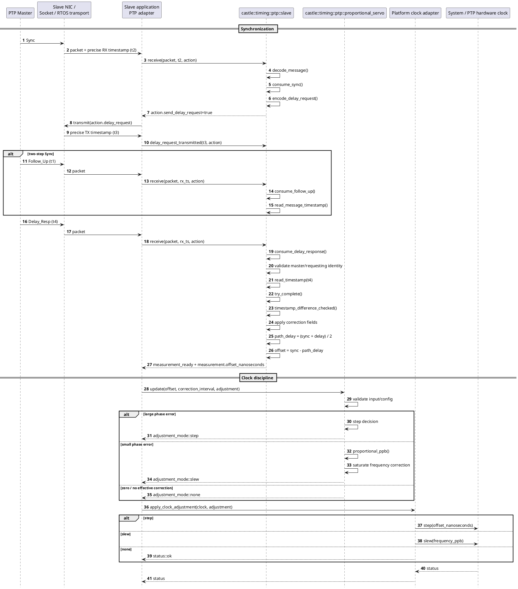

# Timing

## Overview
The Castle timing umbrella header exposes the slave-side time synchronization components as one include. It currently combines the transport-neutral PTPv2 end-to-end slave engine with the deterministic proportional step/slew servo.

## Header
`#include "castle_ext/protocols/timing/timing.hpp"`

## Dependencies
- [`castle_ext/protocols/timing/ptp_v2.hpp`](ptp_v2.md) — PTPv2 slave protocol engine.
- [`castle_ext/protocols/timing/ptp_servo.hpp`](ptp_servo.md) — deterministic clock adjustment policy.

## Public API
The umbrella header adds no new types or functions. It makes the following components available together:

| Component | Purpose |
|---|---|
| `castle::timing::ptp::slave` | Parse PTPv2 traffic and calculate slave/master offset and path delay. |
| `castle::timing::ptp::proportional_servo` | Convert an offset measurement into a bounded step or slew action. |
| PTP utility types/functions | Timestamp, port identity, decoding, Delay_Req encoding, and arithmetic helpers. |
| Clock adapter helper | `apply_clock_adjustment()` dispatches to a user-supplied `step()` / `slew()` adapter. |

See [`PtpV2`](ptp_v2.md) and [`PtpServo`](ptp_servo.md) for complete APIs and algorithm details.

## Usage Example

The matching sample is [`samples/castle_ext/protocols/timing/timing.cpp`](../../../../samples/castle_ext/protocols/timing/timing.cpp).

```cpp
#include "castle_ext/protocols/timing/timing.hpp"

int main()
{
    castle::timing::ptp::port_identity local{};
    local.port_number = 1U;

    castle::timing::ptp::slave protocol(local);
    castle::timing::ptp::proportional_servo servo;
    (void)protocol;
    (void)servo;
    return 0;
}
```

## Detailed End-to-End Sequence Diagram

This is the architectural sequence across the complete Castle timing path. It shows where the master, network timestamping boundary, PTPv2 state machine, servo, and OS/RTOS clock service meet.



### Responsibilities and boundaries

```plantuml
@startuml
left to right direction
rectangle "Master clock" as Master
rectangle "Transport boundary\nEthernet / UDP / socket / RTOS" as Transport
rectangle "castle::timing::ptp::slave\nPTPv2 protocol state" as PTP
rectangle "castle::timing::ptp::proportional_servo\nClock discipline policy" as Servo
rectangle "Platform clock adapter\nstep()/slew()" as Adapter
rectangle "OS / RTOS / PHC" as OS

Master --> Transport : PTP wire messages
Transport --> PTP : RX bytes + t2/timestamp callback
PTP --> Transport : bounded Delay_Req bytes
Transport --> PTP : t3 TX timestamp + Delay_Resp
PTP --> Servo : measured offset
Servo --> Adapter : step/slew action
Adapter --> OS : platform-specific clock operation
OS --> Adapter : status
@enduml
```



## Constraints & Notes

- The umbrella header itself does not allocate or introduce a transport/OS dependency.
- Protocol operation remains event-driven: the application supplies packet bytes and precise timestamps.
- Clock changes are not performed implicitly. Applications explicitly turn measurements into actions and then apply those actions through their platform adapter.
- Include individual headers instead of the umbrella when compile-time include footprint matters.

## Detailed Architecture

```text
                 transport / NIC / driver
                           |
                 RX bytes + RX timestamp
                           v
                 +----------------------+
                 |   PTPv2 slave        |
                 |  castle_ext timing   |
                 +----------+-----------+
                            |
                   Delay_Req action
                            |
                            v
                 transport / NIC / driver
                            |
                     TX timestamp
                            |
                            v
                 +----------------------+
                 |   PTPv2 slave        |
                 +----------+-----------+
                            |
                     measurement
                    (offset, path delay)
                            |
                            v
                 +----------------------+
                 |  proportional servo  |
                 +----------+-----------+
                            |
                  step / slew action
                            |
                            v
                 platform clock adapter
```

The separation means the protocol can be reused whether timestamps come from hardware timestamping, a kernel socket timestamp, Zephyr's network stack, or another deterministic timestamp source. It also makes unit testing possible without a network or real system clock.
