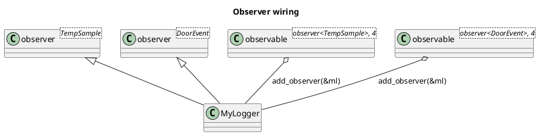

# `castle/design_patterns/observer.h` — Observer / observable

**Header:** `castle/design_patterns/observer.h`
**Namespace:** `castle::design_patterns`
**Sample:** [`samples/sample_observer.cpp`](../../samples/sample_observer.cpp)

## Purpose

Fixed-capacity, allocation-free implementation of the Observer pattern.
Supports **multiple event types per observer** through variadic
inheritance: a single observer class can react to `T1`, `T2`, `T3` …
each via its own `notify(const T&)` overload.

## Design notes

- `observer<T>` — abstract base with `virtual void notify(const T&) = 0`.
- `observer<void>` — specialisation for parameterless notifications
  (`virtual void notify() = 0`).
- `observer<T1, T2, ...>` — recursively inherits from `observer<T1>`
  and `observer<Rest...>`, pulling all `notify` overloads into scope.
  A `static_assert(has_unique_types_v<...>)` rejects duplicate types.
- `observable<TObserver, N>` — fixed-capacity registry of `N`
  `TObserver*` pointers. Provides `add_observer`, `remove_observer`,
  and `notify_observers(data)` / `notify_observers()`.
- **No dynamic allocation.** Slots are a `std::array<TObserver*, N>`.
- Not thread-safe on its own.

## API

### `observer<Ts...>`
| Signature                             | Kind         |
| ------------------------------------- | ------------ |
| `virtual void notify(const T&) = 0`   | Per non-void `T` |
| `virtual void notify() = 0`           | For `observer<void>` |

### `observable<TObserver, N>`
| Method                                     | Returns  |
| ------------------------------------------ | -------- |
| `add_observer(TObserver*)`                 | `bool`   |
| `remove_observer(TObserver*)`              | `bool`   |
| `notify_observers(const TData&)`           | `void`   |
| `notify_observers()`                       | `void`   |

`add_observer` refuses `nullptr`, refuses duplicates, and refuses
enrolment when the registry is full — all via return value `false`.

## Diagram



## Example

```cpp
#include <castle/design_patterns/observer.h>
using namespace castle::design_patterns;

struct temp_sample { float celsius; };
struct door_event  { bool  open;    };

class hmi
    : public observer<temp_sample>
    , public observer<door_event>
{
public:
    void notify(const temp_sample& s) override { /* update UI */ }
    void notify(const door_event&  e) override { /* animate  */ }
};

observable<observer<temp_sample>, 4> temp_hub;
observable<observer<door_event>,  4> door_hub;

hmi ui;
temp_hub.add_observer(&ui);
door_hub.add_observer(&ui);

temp_hub.notify_observers(temp_sample{23.4f});
door_hub.notify_observers(door_event{true});
```

## See also

- `castle/callbacks/callback_registry.h` — a lower-level, function-based
  publish/subscribe primitive.
- `castle/design_patterns/visitor.h` — same "recursive variadic bases"
  trick applied to double-dispatch.
