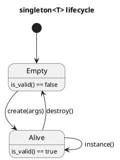

# `castle/design_patterns/singleton.h` — Deterministic singleton

**Header:** `castle/design_patterns/singleton.h`
**Namespace:** `castle::design_patterns`
**Sample:** [`samples/sample_singleton.cpp`](../../samples/sample_singleton.cpp)

## Purpose

A **safety-critical, embedded-friendly** singleton facade for a single
instance of a user type `T`. Storage lives in the singleton's own
aligned static buffer — there is no heap allocation, no
static-initialisation-order fiasco, and the caller decides *exactly*
when construction and destruction occur.

## Design notes

- Backed by `std::aligned_storage<sizeof(T), alignof(T)>` and a
  `bool s_is_valid` flag.
- **No exceptions.** Misuse (double `create()`, `instance()` before
  `create()`, `destroy()` before `create()`) trips
  `SINGLETON_ASSERT(cond, msg)`. Redefine that macro before including
  to plug into your project's fault handler.
- All-static facade: constructors, destructor, copy, and move are
  deleted. You cannot accidentally instantiate `singleton<T>` itself.
- **Not thread-safe by design.** The caller owns synchronisation
  around `create()` / `destroy()`. Read-only `instance()` access is
  safe for concurrent readers once construction has completed.
- `create(...)` perfect-forwards its arguments to `T`'s constructor.

## API

| Method                          | Precondition           | Notes                    |
| ------------------------------- | ---------------------- | ------------------------ |
| `create(Args&&... args)`        | `!is_valid()`          | Constructs T in-place    |
| `destroy()`                     | `is_valid()`           | Runs `T::~T()`           |
| `instance()`                    | `is_valid()`           | Returns `T&`             |
| `is_valid()`                    | —                      | `bool`, `noexcept`       |

## Diagram



## Example

```cpp
#include <castle/design_patterns/singleton.h>

class hw_clock { public: hw_clock(int freq_hz); /* ... */ };
using clk = castle::design_patterns::singleton<hw_clock>;

int main() {
    clk::create(48'000'000);       // explicit init at startup
    clk::instance().tick();
    clk::destroy();                // explicit teardown at shutdown
}
```

## Notes / pitfalls

- Because construction is explicit, do **not** call `instance()` in
  static initialisers of other translation units unless you have
  ensured `create()` runs first.
- Redefining `SINGLETON_ASSERT` lets you route misuse to a bootloader
  fault handler or a watchdog kick.

## See also

- `castle/logging/logging.h` — the built-in logger uses this pattern.
