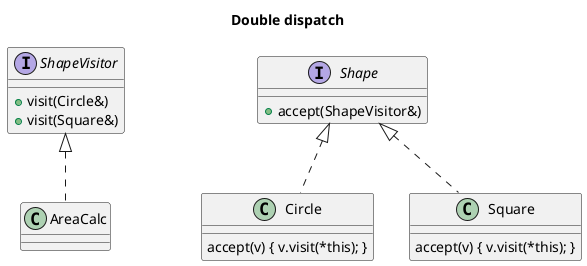

# `castle/design_patterns/visitor.h` — Type-safe visitor / visitable

**Header:** `castle/design_patterns/visitor.h`
**Namespace:** `castle::design_patterns`
**Sample:** [`samples/sample_visitor.cpp`](../../samples/sample_visitor.cpp)

## Purpose

Compile-time-checked GoF Visitor. A single `visitor<Ts...>` inherits
`visit(T)` overloads for every element type; every `visitable<Vs...>`
inherits an `accept(V&)` overload for every visitor family. This
enables statically-checked **double dispatch** without any hidden
dynamic allocation.

## Design notes

- Recursive variadic inheritance — mirrors the trick used in
  `observer<>`.
- A `static_assert(has_unique_types_v<...>)` guards against accidental
  duplicate element types.
- Element types can be spelled as value, `T&`, or `const T&` — the
  visitor overload matches the exact parameter form.
- Only `visit(...)` and `accept(...)` are virtual. Everything else is
  statically dispatched.

## API

### `visitor<Ts...>`
| Member                             | Notes                       |
| ---------------------------------- | --------------------------- |
| `virtual void visit(T) = 0`        | one per element type        |

### `visitable<Vs...>`
| Member                             | Notes                       |
| ---------------------------------- | --------------------------- |
| `virtual void accept(V&) = 0`      | one per visitor family      |

## Diagram



## Example

```cpp
#include <castle/design_patterns/visitor.h>
using namespace castle::design_patterns;

struct circle; struct square;

using shape_visitor = visitor<circle&, square&>;

struct shape : visitable<shape_visitor> {};

struct circle : shape {
    float r;
    void accept(shape_visitor& v) override { v.visit(*this); }
};
struct square : shape {
    float s;
    void accept(shape_visitor& v) override { v.visit(*this); }
};

class area_calc : public shape_visitor {
public:
    float total = 0;
    void visit(circle& c) override { total += 3.14159f * c.r * c.r; }
    void visit(square& s) override { total += s.s * s.s; }
};
```

## See also

- `castle/design_patterns/observer.h` — same variadic-inheritance
  technique.
