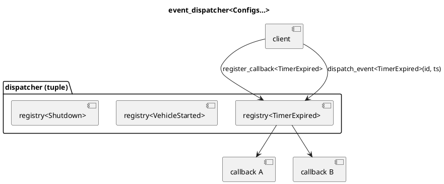

# `castle/events/event_dispatcher.h` — Tag-keyed dispatcher (non-owning)

**Header:** `castle/events/event_dispatcher.h`
**Namespace:** `castle::events`
**Sample:** [`samples/sample_event_dispatcher.cpp`](../../samples/sample_event_dispatcher.cpp)

## Purpose

`event_dispatcher<EventConfigs...>` is a **compile-time, tag-keyed**
event dispatcher. Each event is identified by a **type** (the event
tag), and each event owns its own fixed-capacity, non-owning
`callback_registry<max_callback, signature>`.

Tag-based lookup is resolved at compile time to a `std::tuple` index —
O(1), no hashing, no `std::type_index`, no virtual dispatch on the fan-
out, no heap.

## Design notes

- Configuration is a pack of `event_config<...>` (see
  `event_config.h`); the same pack works for the SBO variant.
- Signatures are required to be `void(Args...)`. A friendly
  `static_assert` at the dispatcher's front door rejects anything else.
- Per-event enable/disable state is tracked by
  `std::bitset<sizeof...(Configs)>`.
- Non-owning: subscribers are `i_function<void(Args...)>*` (from
  `castle/callbacks/function.h`). Their lifetime is the caller's
  responsibility.
- Non-copyable / non-movable (registry identity is embedded in
  outstanding subscription handles).

## API

| Method                                              | Notes                                    |
| --------------------------------------------------- | ---------------------------------------- |
| `register_callback<Tag>(i_function<...>*, err = nullptr)` | Returns `callback_subscription` |
| `dispatch_event<Tag>(args...)`                      | Fan-out in registration order            |
| `enable_event<Tag>()` / `disable_event<Tag>()`      | Bitset gate                              |
| `is_event_enabled<Tag>()`                           | `bool`                                   |
| `clear<Tag>()` / `clear_all()`                      | Invalidate outstanding subscriptions     |
| `size<Tag>()` / `capacity<Tag>()`                   | Introspection                            |

Error type: `event_subscription_error { ok, full, invalid_callback,
invalid_subscription, event_disabled }`.

## Diagram



## Example

```cpp
struct TimerExpired {};
struct VehicleStarted {};

using dispatcher_t = castle::events::event_dispatcher<
    castle::events::event_config<TimerExpired,   8, void(std::uint32_t, std::uint32_t)>,
    castle::events::event_config<VehicleStarted, 4, void(std::uint8_t)>
>;

dispatcher_t d;
void on_timer(std::uint32_t, std::uint32_t);
castle::callbacks::function<void(std::uint32_t, std::uint32_t)> cb(&on_timer);
auto sub = d.register_callback<TimerExpired>(&cb);
d.dispatch_event<TimerExpired>(42u, 1000u);
sub.unsubscribe();
```

## See also

- `event_config.h` — descriptor type.
- `inplace_event_dispatcher.h` — owning / SBO variant.
- `castle/callbacks/callback_registry.h` — per-event storage backend.
