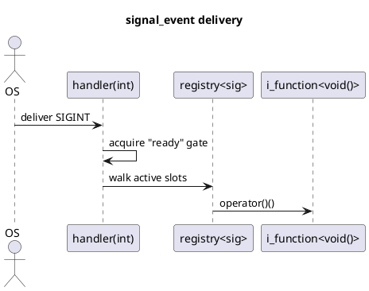

# `castle/events/signal_event.h` — POSIX signal dispatcher (non-owning)

**Header:** `castle/events/signal_event.h`
**Namespace:** `castle::events`
**Sample:** [`samples/sample_signal_event.cpp`](../../samples/sample_signal_event.cpp)

## Purpose

`signal_event<SignalConfigs...>` is an **all-static, compile-time,
signum-keyed OS-signal dispatcher**. It installs a `sigaction` handler
per managed signal and, when the OS delivers the signal, walks the
matching `callback_registry<max_callback, void()>` directly **from
signal context**.

## Design notes

- Managed signals are fixed at compile time via a pack of
  `signal_config<...>` (see `signal_config.h`). Duplicate signum
  entries are rejected at compile time.
- Callback signature is `void()`. Any per-signal payload lives inside
  the concrete `i_function<>` variant (typically `function_ct` /
  `function_ct_m` / `function_ct_im`), not in the call args.
- All-static, namespace-shaped API — nothing to instantiate:
  `signal_event::register_callback<signal::sigint>(&cb)`,
  `signal_event::install()`, ...
- **Immediate dispatch:** no deferred queue, no `dispatch_pending()`.
  The library's own path is a bounded signum→index scan, a bitset
  test, and a walk of non-owning `i_function<>*` pointers.
- A single **atomic "ready" gate** synchronises setup with signal
  delivery: `install()` acts as a release barrier that publishes every
  prior `register_callback()`; the handler performs an acquire-load
  and bails out if setup is incomplete or `uninstall()` has started.
- Error type: `event_subscription_error { ok, full, invalid_callback,
  invalid_subscription, signal_disabled, system_call_error }`.

## ⚠ Async-signal-safety

Callback bodies run **in signal context**. They must themselves be
async-signal-safe:

- No `malloc`/`new`/`delete` (no `std::string`, `std::vector`, …).
- No mutex / condition variable / any locking that the interrupted
  thread might already hold.
- No `printf` / `std::cout`. Use `write(2)` on `STDERR_FILENO` if you
  really need diagnostics.
- Only the functions listed in POSIX **signal-safety(7)** are legal.

If you cannot meet these constraints, set an `std::atomic_flag` or
write a byte to a self-pipe from the callback and do the real work
from a normal thread.

## API (all static)

| Method                                                  | Notes                              |
| ------------------------------------------------------- | ---------------------------------- |
| `register_callback<Signal>(i_function<void()>*, err_out)`| Non-owning subscribe               |
| `install()`                                             | Arms `sigaction`; release barrier  |
| `uninstall()`                                           | Restores previous handlers         |
| `enable_signal<Signal>()` / `disable_signal<Signal>()`  | Bitset gate                        |
| `is_signal_enabled<Signal>()`                           | `bool`                             |
| `clear<Signal>()` / `clear_all()`                       | Invalidate outstanding handles     |

## Diagram



## Example

```cpp
#include <castle/events/signal_event.h>
using castle::events::signal;
using castle::events::signal_config;

void on_sigint() { /* async-signal-safe body */ }
castle::callbacks::function<void()> cb(&on_sigint);

using signals_t = castle::events::signal_event<
    signal_config<signal::sigint,  4>,
    signal_config<signal::sigterm, 1>
>;

auto sub = signals_t::register_callback<signal::sigint>(&cb);
signals_t::install();
// … application runs …
signals_t::uninstall();
sub.unsubscribe();
```

## See also

- `signal_config.h` — descriptor type.
- `inplace_signal_event.h` — owning / SBO variant.
- `castle/callbacks/function.h` — callable variants suitable for
  signal context.
