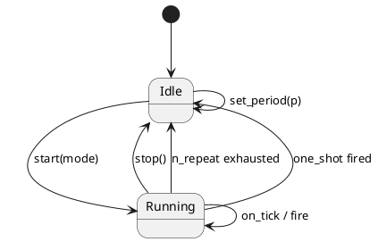

# `castle/events/tick_timer.h` — Tick-driven software timer (non-owning)

**Header:** `castle/events/tick_timer.h`
**Namespace:** `castle::events`
**Sample:** [`samples/sample_tick_timer.cpp`](../../samples/sample_tick_timer.cpp)

## Purpose

`tick_timer<MaxCallback>` is a **fixed-capacity, heap-free** software
timer. It is a passive accumulator: **it does not read a clock and does
not own a thread**. Instead, the tick source (a SysTick ISR, an RTOS
tick hook, or an event loop) advances it via `on_tick(ticks)`.

Callback signature is `void()` — the timeout event carries no payload;
per-callback state lives in the concrete `i_function<>` variant.

## Design notes

- Registry: internal `callback_registry<MaxCallback, void()>` — the
  callbacks are **non-owning** `i_function<void()>*` pointers.
- Repeat modes: `one_shot`, `periodic`, `n_repeat` (fires N times then
  stops).
- Error type: `tick_timer_error { ok, full, invalid_callback,
  invalid_subscription, invalid_config, not_configured }`.
- Non-copyable / non-movable.
- All state mutations are `noexcept`.

## API

| Method                                | Returns / Notes                              |
| ------------------------------------- | -------------------------------------------- |
| `set_period(tick_type)`               | `error`; `invalid_config` for `0`            |
| `register_callback(i_function<void()>*, err_out)` | `subscription`                    |
| `start(mode)` / `start(mode, N)`      | `not_configured` if period is unset          |
| `stop()`                              | Halts and rewinds accumulator                |
| `on_tick(elapsed_ticks = 1)`          | Advances the timer; fires callbacks          |
| `remaining() const`                   | Ticks until next fire                        |
| `is_running() const`                  | `bool`                                       |

## Diagram — state machine



## Example

```cpp
#include <castle/events/tick_timer.h>
using castle::events::tick_timer;
using castle::events::tick_timer_mode;

void on_timeout();
castle::callbacks::function_ct<&on_timeout> cb;   // zero-storage

tick_timer<4> t;
t.set_period(100);                                // 100 ticks
auto sub = t.register_callback(&cb);
t.start(tick_timer_mode::periodic);

// From SysTick / RTOS tick / event loop:
t.on_tick(1);

// Teardown
sub.unsubscribe();
t.stop();
```

## See also

- `inplace_tick_timer.h` — SBO variant that owns its callables.
- `castle/callbacks/callback_registry.h` — subscriber storage.
- `castle/callbacks/callback_policy.h` — for **rate-limiting** a single
  callable rather than driving many.
