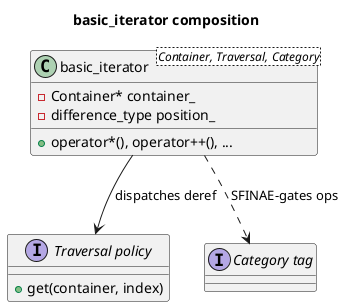

# `castle/iterators/iterator.h` — `basic_iterator` + algorithms

**Header:** `castle/iterators/iterator.h`
**Namespace:** `castle::iterators` (algorithms re-exported at `castle::`)

## Purpose

Defines `basic_iterator<Container, Traversal, Category>`, the **generic
logical cursor** used by every CASTLE container (`ring_buffer`,
`fixed_string`, `stack_buffer`, `soo_buffer`, and future heaps).

Unlike an STL contiguous iterator, a CASTLE iterator does **not** store
a `T*`; it stores a `Container*` plus a logical `position_`. This lets
containers whose storage order differs from their traversal order
(circular buffers, heaps) reuse the same iterator class — they only
have to implement one method: `iterator_at(index)`.

Also provides generic algorithms `advance`, `next`, `prev`, `distance`
that dispatch on the iterator category at **compile time** via
`if constexpr`.

## Design notes

- Category-gated operations — increment for all categories, decrement
  for bidirectional and above, random-access (`+=`, `-=`, `[]`, `<`,
  ...) only when the category derives from
  `random_access_iterator_tag`. Non-supported ops don't exist in the
  overload set for weaker categories.
- Safe `iterator -> const_iterator` promotion is enabled (const
  correctness); the reverse direction is deleted.
- `operator->` returns a real pointer when the traversal produces an
  lvalue reference, or a small `arrow_proxy` holder if it returns a
  proxy reference. This keeps `it->member` well-defined even for
  bit-packed containers that don't expose real `T&`.
- `CASTLE_ITERATOR_ASSERT` guards precondition checks
  (same-container ordering, non-null dereference). Compiles out under
  `NDEBUG`; redefine before including for project-specific fault
  handling.

## Traversal policy

The default policy `iterator_at_traversal` calls
`container.iterator_at(index)`:

```cpp
struct iterator_at_traversal {
    template <typename C>
    static constexpr decltype(auto) get(C& c, std::size_t i) noexcept {
        return c.iterator_at(i);
    }
};
```

A container implementing `iterator_at(i)` (O(1) access to logical
element `i`) gets a full random-access iterator for free.

## API surface (excerpt)

| Member / free function                       | Notes                            |
| -------------------------------------------- | -------------------------------- |
| `basic_iterator()` / `(Container*, pos)`     | Singular / positioned            |
| `operator*` / `operator->`                   | Delegates to `Traversal::get`    |
| `operator++` / `operator--`                  | Decrement gated on category      |
| `+=`, `-=`, `+`, `-`, `[]`                   | Random-access only               |
| `==`, `!=`, `<`, `<=`, `>`, `>=`             | Category-gated                   |
| `advance(it, n)`                             | Category-optimised               |
| `next(it, n=1)` / `prev(it, n=1)`            | Non-mutating variants            |
| `distance(first, last)`                      | O(1) for random-access           |

## Diagram



## Example

```cpp
#include <castle/buffers/ring_buffer.h>
#include <castle/iterators/iterator.h>

castle::buffers::ring_buffer<int, 8> q;
for (int i = 0; i < 5; ++i) q.push(i);

auto it = q.begin();
castle::advance(it, 2);
auto d  = castle::distance(q.begin(), q.end()); // 5
```

## See also

- `iterator_traits.h` — typedefs and category tags.
- `reverse_iterator.h` — bidirectional-and-above reverse wrapper.
- `castle/buffers/*` — every buffer implements `iterator_at`.
