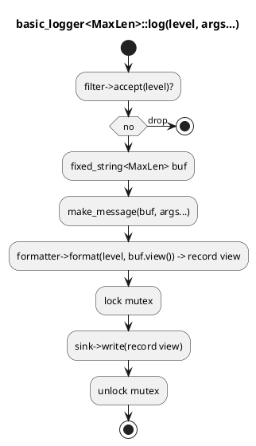

# `castle/logging/logging.h` — Allocation-free logger

**Header:** `castle/logging/logging.h`
**Namespace:** `castle::logging`
**Sample:** [`samples/sample_logging.cpp`](../../samples/sample_logging.cpp)

## Purpose

An embedded-friendly logger that **never allocates on the hot path**.
Every record is assembled in a stack-allocated
`castle::buffers::fixed_string<N>`, then handed off to a sink through
`std::string_view`. Deterministic upper bound on record size, no
`std::string`, no `std::ostringstream`, no heap fragmentation.

## Components

| Type / macro                              | Role                                                    |
| ----------------------------------------- | ------------------------------------------------------- |
| `enum class log_level`                    | `trace`, `debug`, `info`, `warning`, `error`, `fatal`, `off` |
| `i_log_sink`                              | Interface — receives finished records (`std::string_view`)  |
| `i_log_formatter`                         | Interface — turns `(level, message)` into a full record     |
| `i_log_filter`                            | Interface — gates records before formatting                 |
| `ostream_sink`                            | Concrete sink over any `std::ostream&` (e.g. `std::cout`)   |
| `default_formatter`                       | `"[LEVEL] message"` style, no allocation                    |
| `level_filter`                            | Filters by minimum `log_level`                              |
| `basic_logger<MaxLen = 256>`              | The core logger; template parameter is record capacity     |
| `basic_logger_registry<MaxLen>`           | Singleton-style access + factory                            |
| Macros `LOG_TRACE / LOG_DEBUG / LOG_INFO / LOG_WARNING / LOG_ERROR / LOG_FATAL` | Variadic front-ends |
| `LOG_SET_LEVEL(level)`                    | Runtime min-level override                                  |

## Design notes

- Record capacity `MaxLen` is a **compile-time template parameter**.
  Every record fits in `MaxLen + 1` bytes on the stack; overflowing
  records are truncated with a `"..."` sentinel courtesy of
  `fixed_string`.
- `build_message` / `make_message` variadically stringify their
  arguments using `fixed_string::append` overloads — no `std::ostringstream`.
- Dependency injection is fully supported (custom sink, formatter,
  filter); a singleton facade `basic_logger_registry<MaxLen>` is also
  provided for the common case.
- Thread safety inside the logger is handled with a `std::mutex`
  guarding the sink; `fixed_string` itself is used on the stack of the
  calling thread, so log message assembly does not contend.
- Zero heap allocation once the logger and its sinks are constructed.

## Diagram — record lifecycle



## Example — singleton use with macros

```cpp
#include <castle/logging/logging.h>
using namespace castle::logging;

using logger_registry = basic_logger_registry<256>;

int main() {
    LOG_SET_LEVEL(log_level::info);

    LOG_INFO("boot ok, id=", 42, " temp=", 23.5f);
    LOG_WARNING("battery low: ", 3.6, " V");
    LOG_ERROR("comm failure on bus ", 1);
}
```

## Example — dependency injection

```cpp
class my_sink final : public i_log_sink {
public:
    void write(std::string_view record) noexcept override {
        write(STDERR_FILENO, record.data(), record.size());
    }
};

my_sink       sink;
default_formatter fmt;
level_filter  flt{log_level::debug};

basic_logger<128> lg{&sink, &fmt, &flt};
lg.log_debug("sensor=", 0x12, " raw=", 0xABCDu);
```

## Notes / pitfalls

- Pick `MaxLen` per the tightest record you can accept — it defines
  a hard per-call stack footprint. Truncated records are marked so
  operators can spot silent clipping.
- Macros use the singleton registry (`::logger_registry::instance()`),
  so make sure your alias for `logger_registry` is a global typedef
  matching your chosen `MaxLen`.
- Sinks and formatters run inside the logger's mutex — keep their
  bodies short and non-blocking.

## See also

- `castle/buffers/fixed_string.h` — stack-allocated record builder.
- `castle/design_patterns/singleton.h` — pattern used by the registry.
