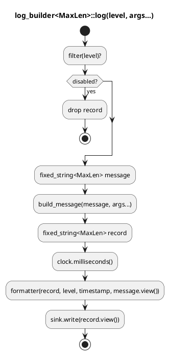

# `castle/logging/log_builder.h` — Deterministic, allocation-free logger

**Header:** `castle/logging/log_builder.h`

**Namespace:** `castle::logging`

**Sample:** [`samples/sample_logging.cpp`](../../samples/sample_logging.cpp)

## Purpose

An embedded-friendly logger designed for systems with strict resource and
runtime constraints.

The logger assembles every record using a stack-allocated

`castle::buffers::fixed_string<N>`

and sends the completed record to a user-provided sink.

The logger does **not** own the sink, formatter, filter, or clock.

The design intentionally avoids:

* dynamic memory allocation
* RTTI
* `dynamic_cast`
* virtual functions
* `std::shared_ptr`
* `std::unique_ptr`
* singleton state
* hidden global logger state
* internal synchronization primitives

The record capacity is controlled by the `MaxLen` template parameter, allowing
different logger instances to have different deterministic memory budgets.

## Components

| Type / function                           | Role                                                          |
| ----------------------------------------- | ------------------------------------------------------------- |
| `enum class log_level`                    | `debug`, `info`, `warning`, `error`, `none`                   |
| `log_sink`                                | Non-owning sink descriptor using a function pointer + context |
| `log_clock`                               | Non-owning timestamp provider                                 |
| `formatter_fn<MaxLen>`                    | Function type for formatting a complete record                |
| `filter_fn`                               | Function type for filtering records before formatting         |
| `default_format`                          | Default `"[123ms][INFO ] message"` formatter                  |
| `level_filter`                            | Filters records using a minimum `log_level`                   |
| `log_builder<MaxLen = 256>`               | Core logger; `MaxLen` is the compile-time record capacity     |
| `log_builder::set_min_level()`            | Runtime minimum-level configuration                           |
| `log_builder::set_sink()`                 | Replace the output sink                                       |
| `log_builder::set_clock()`                | Replace the timestamp source                                  |
| `log_builder::set_formatter()`            | Replace the record formatter                                  |
| `log_builder::set_filter()`               | Replace the filtering policy                                  |
| `log_builder::debug/info/warning/error()` | Convenience logging functions                                 |

## Design notes

* Record capacity `MaxLen` is a **compile-time template parameter**.

  The logger uses `castle::buffers::fixed_string<MaxLen>` for bounded record
  construction. The exact object size is therefore known at compile time.

* There is **no singleton registry**.

  Each logger is an independent object and may use a different `MaxLen`,
  sink, filter, formatter, and clock.

* Dependency injection is implemented using a lightweight C-style type-erasure
  mechanism:

  ```text
  function pointer + void* context
  ```

  This provides runtime configurability without RTTI or virtual dispatch.

* The sink is **non-owning**.

  The object referenced by `context` must outlive the logger.

* The logger never allocates memory on the logging path.

* Filtering happens **before message construction**.

  Disabled log messages therefore avoid constructing the
  `fixed_string` message buffer.

* Timestamp generation is optional.

  If no clock is configured, the timestamp is `0`.

* Synchronization is intentionally **not part of `log_builder`**.

  The application decides whether logging requires a mutex, interrupt-safe
  sink, RTOS synchronization, lock-free queue, or no synchronization at all.

* The logger is therefore suitable for multiple execution models:

  ```text
  bare-metal
      |
      +-- single-threaded
      |
      +-- ISR + main loop

  RTOS
      |
      +-- task logging
      +-- synchronized sink

  AUTOSAR
      |
      +-- task context
      +-- OS counter
      +-- diagnostic transport
  ```

* Sink callbacks must consume the supplied `std::string_view` synchronously.
  The view refers to a stack buffer owned by the current `log()` call and must
  not be retained after the callback returns.

## Diagram — record lifecycle



## Example — standalone logger

```cpp
#include <castle/logging/log_builder.h>

#include <cstdint>
#include <iostream>
#include <string_view>

using namespace castle::logging;

void console_sink(
    void* /*context*/,
    std::string_view record) noexcept
{
    std::cout << record << '\n';
}

int main()
{
    log_builder<256U> log{
        {
            &console_sink,
            nullptr
        }
    };

    log.set_min_level(log_level::debug);

    const int satellites = 8;
    const bool has_fix = true;

    log.info(
        "Satellites in view: ",
        satellites,
        " (fix=",
        has_fix,
        ")"
    );

    log.debug(
        "This is a debug message containing a number: ",
        42
    );

    log.warning(
        "UART buffer is filling up! Current load: ",
        85,
        "%"
    );

    log.error(
        "Hardware fault detected!"
    );
}
```

Example output:

```text
[0ms][INFO ] Satellites in view: 8 (fix=1)
[0ms][DEBUG] This is a debug message containing a number: 42
[0ms][WARN ] UART buffer is filling up! Current load: 85%
[0ms][ERROR] Hardware fault detected!
```

## Example — independent local logger

Unlike the previous singleton-based implementation, every
`log_builder` instance has its own configuration.

```cpp
#include <castle/logging/log_builder.h>

#include <iostream>
#include <string_view>

using namespace castle::logging;

void stdout_sink(
    void* /*context*/,
    std::string_view record) noexcept
{
    std::cout << record << '\n';
}

void stderr_sink(
    void* /*context*/,
    std::string_view record) noexcept
{
    std::cerr << record << '\n';
}

int main()
{
    log_builder<256U> application_log{
        {
            &stdout_sink,
            nullptr
        }
    };

    application_log.set_min_level(
        log_level::debug
    );

    application_log.info(
        "Application started"
    );


    // Completely independent logger.
    log_builder<128U> diagnostic_log{
        {
            &stderr_sink,
            nullptr
        }
    };

    diagnostic_log.set_min_level(
        log_level::warning
    );


    // Filtered out:
    // info < warning
    diagnostic_log.info(
        "This message will NOT be printed"
    );


    // Printed:
    // warning >= warning
    diagnostic_log.warning(
        "Temperature threshold exceeded"
    );


    diagnostic_log.error(
        "Hardware fault detected"
    );
}
```

The two logger instances have independent:

* buffer capacities
* minimum levels
* sinks
* formatters
* filters
* timestamp sources

No global logger state is involved.

## Example — embedded UART sink

The logger does not require a particular transport.

For example, an embedded UART driver can be connected using a small adapter:

```cpp
#include <castle/logging/log_builder.h>

#include <string_view>

class uart
{
public:
    void write(std::string_view data) noexcept
    {
        // HAL_UART_Transmit(...);
    }
};

void uart_sink(
    void* context,
    std::string_view record) noexcept
{
    auto& port =
        *static_cast<uart*>(context);

    port.write(record);
}
```

The logger can then be constructed as:

```cpp
uart debug_uart;

castle::logging::log_builder<256U> log{
    {
        &uart_sink,
        &debug_uart
    }
};

log.info("System started");
log.warning("Battery voltage=", 3.6F);
log.error("CAN communication failure");
```

The logger does not own `debug_uart`.

The application controls the lifetime of the UART driver.

## Example — timestamp provider

The timestamp source is also injected through a function pointer and context.

```cpp
#include <cstdint>

struct system_timer
{
    std::uint32_t tick_ms;

    std::uint32_t milliseconds() const noexcept
    {
        return tick_ms;
    }
};

std::uint32_t timer_callback(
    void* context) noexcept
{
    const auto& timer =
        *static_cast<const system_timer*>(context);

    return timer.milliseconds();
}
```

Configure the logger:

```cpp
system_timer timer{
    1234U
};

log_builder<256U> log{
    {
        &uart_sink,
        &debug_uart
    },
    {
        &timer_callback,
        &timer
    }
};

log.info("System started");
```

Example output:

```text
[1234ms][INFO ] System started
```

The logger does not depend on `std::chrono`.

The timestamp source can therefore be backed by:

* MCU system tick
* SysTick
* GPT
* RTC
* RTOS tick counter
* AUTOSAR OS counter
* application-specific monotonic timer

## Example — custom filter

Filters use the same function-pointer + context mechanism.

```cpp
struct diagnostic_filter
{
    bool enabled;
    bool allow_debug;
};

bool diagnostic_filter_fn(
    void* context,
    castle::logging::log_level level) noexcept
{
    const auto& filter =
        *static_cast<const diagnostic_filter*>(context);

    if (!filter.enabled)
    {
        return false;
    }

    if (level == castle::logging::log_level::debug)
    {
        return filter.allow_debug;
    }

    return true;
}
```

Configure it:

```cpp
diagnostic_filter filter{
    true,
    false
};

log.set_filter(
    &diagnostic_filter_fn,
    &filter
);
```

No RTTI or polymorphic base class is required.

## Example — custom formatter

A custom formatter can completely replace the default record format.

```cpp
template <std::size_t N>
void compact_formatter(
    castle::buffers::fixed_string<N>& output,
    castle::logging::log_level level,
    std::uint32_t timestamp,
    std::string_view message) noexcept
{
    output.append("[");
    output.append(timestamp);
    output.append("] ");

    switch (level)
    {
        case castle::logging::log_level::debug:
            output.append("D ");
            break;

        case castle::logging::log_level::info:
            output.append("I ");
            break;

        case castle::logging::log_level::warning:
            output.append("W ");
            break;

        case castle::logging::log_level::error:
            output.append("E ");
            break;

        default:
            output.append("? ");
            break;
    }

    output.append(message);
}
```

Configure:

```cpp
log_builder<128U> log{
    {
        &uart_sink,
        &debug_uart
    }
};

log.set_formatter(
    &compact_formatter<128U>
);
```

The resulting format can be significantly smaller:

```text
[1234] I System started
[1234] W Battery low
[1234] E CAN failure
```

This is useful when log bandwidth is limited.

## Example — different capacities

`MaxLen` can be selected according to the subsystem.

```cpp
log_builder<64U> boot_log{
    {
        &uart_sink,
        &debug_uart
    }
};

log_builder<256U> application_log{
    {
        &uart_sink,
        &debug_uart
    }
};

log_builder<1024U> diagnostic_log{
    {
        &uart_sink,
        &debug_uart
    }
};
```

This gives each subsystem an explicit memory budget.

For example:

```text
boot_log
    64 bytes

application_log
    256 bytes

diagnostic_log
    1024 bytes
```

There is no requirement for every logger in the system to use the same
capacity.

## Notes / pitfalls

* Pick `MaxLen` according to the largest record that the subsystem can
  reasonably emit.

  `MaxLen` directly affects the stack footprint of the logging operation.

* Filtering occurs before message construction, so disabled log levels do not
  consume the message-building buffer.

* The sink receives a `std::string_view` referring to temporary stack storage.

  It must not retain the pointer after returning.

* The sink should be short and deterministic.

  A blocking UART driver can make logging itself blocking.

* `log_builder` does not provide synchronization.

  If multiple tasks can use the same logger concurrently, synchronization must
  be provided by the application or by a synchronized sink.

* An ISR should not normally call a logger whose sink performs blocking I/O.

  For ISR logging, use a dedicated ISR-safe sink or enqueue records into a
  bounded ring buffer.

* The `void* context` supplied to a sink, filter, or clock is non-owning.

  The referenced object must remain alive for as long as the callback may be
  invoked.

* Avoid storing references or pointers to the logger's internal record buffer.

* A logger object should normally be created at a scope where its lifetime is
  clear, such as a subsystem object, application object, or static-storage
  object owned explicitly by the application.

* `log_builder` intentionally does not implement a singleton.

  If an application requires a global logger, it can explicitly own one:

  ```cpp
  castle::logging::log_builder<256U> application_logger{
      {
          &uart_sink,
          &debug_uart
      }
  };
  ```

  This keeps ownership and configuration visible instead of hiding them behind
  a registry.

* The current implementation uses `std::string_view` as the non-owning string
  abstraction.

  If Castle moves toward a fully STL-independent/freestanding layer, this
  dependency should eventually be replaced with a Castle-native string-view
  type.

## Design constraints

`log_builder` is intentionally designed around the following constraints:

| Constraint                             | Status           |
| -------------------------------------- | ---------------- |
| Dynamic allocation on log path         | **Not used**     |
| `new` / `delete`                       | **Not used**     |
| RTTI                                   | **Not required** |
| `dynamic_cast`                         | **Not used**     |
| Virtual functions                      | **Not used**     |
| Singleton                              | **Not used**     |
| Hidden global state                    | **Not used**     |
| Compile-time buffer capacity           | **Supported**    |
| Bounded string construction            | **Supported**    |
| Custom sink                            | **Supported**    |
| Custom formatter                       | **Supported**    |
| Custom filter                          | **Supported**    |
| Custom clock                           | **Supported**    |
| Application-controlled synchronization | **Supported**    |
| Deterministic logger object size       | **Supported**    |

## See also

* `castle/buffers/fixed_string.h` — stack-allocated, bounded string builder.
* `castle/buffers/` — fixed-capacity containers and buffers.
* `castle/logging/log_builder.h` — allocation-free logging implementation.

## Migration from the previous logger

The previous API used a singleton registry and macros:

```cpp
LOG_SET_LEVEL(log_level::info);

LOG_INFO("boot ok, id=", 42);
LOG_WARNING("battery low");
LOG_ERROR("communication failure");
```

The new API makes the logger an explicit dependency:

```cpp
log_builder<256U> log{
    {
        &uart_sink,
        &debug_uart
    }
};

log.set_min_level(log_level::info);

log.info("boot ok, id=", 42);
log.warning("battery low");
log.error("communication failure");
```

The main architectural difference is intentional:

```text
OLD

application
    |
    +--> global LOG_INFO()
              |
              +--> singleton registry
                       |
                       +--> logger
```

versus:

```text
NEW

application
    |
    +--> log_builder<256>
             |
             +--> sink
             +--> filter
             +--> formatter
             +--> clock
```

The new model makes dependencies, lifetime, memory capacity, and runtime
configuration explicit.

It also makes it possible for different subsystems to use different logging
policies without relying on global state.
