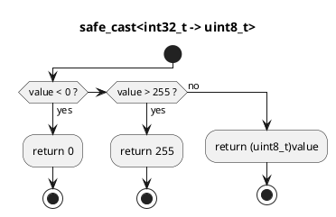

# `castle/types/safe_cast.h` — Saturating numeric conversions

**Header:** `castle/types/safe_cast.h`
**Namespace:** `castle::types`
**Sample:** [`samples/sample_safe_cast.cpp`](../../samples/sample_safe_cast.cpp)

## Purpose

Provides **well-defined** conversions between:

- `bool`,
- every signed / unsigned integer of width 8, 16, 32, 64,
- `float` and `double`.

Whenever the source value is out of range for the destination, the
result is **saturated** to the destination's `MIN`/`MAX`. NaN and
sub-integer floats are handled explicitly. This eliminates the
undefined behaviour that `static_cast` allows on out-of-range float→int
conversions and gives MISRA / AUTOSAR reviewers a single, auditable
choke-point for numeric conversions.

## Design notes

- Two equivalent front-ends are exposed:
  1. **Named methods** on the `safe_cast` class:
     `safe_cast::int32_to_uint8(v)`, `safe_cast::float_to_int16(v)`,
     `safe_cast::double_to_bool(v)`, … one per source→dest pair.
  2. **Generic function template**
     `template <typename From, typename To> To SAFE_CAST(From)` with
     explicit specialisations for every supported `<From, To>` pair.
     Instantiating an unsupported pair fails to link (or to compile)
     rather than silently reinterpreting bits.
- No exceptions, no allocations, `inline` — safe on the hot path.
- Floating-point comparisons use an internal epsilon
  (`detail::EPSILON = 1e-9`) to reject only true rounding artefacts.

## Coverage matrix

| From \\ To | bool | i8 | i16 | i32 | i64 | u8 | u16 | u32 | u64 | f32 | f64 |
| ---------- | :--: | :-: | :-: | :-: | :-: | :-: | :-: | :-: | :-: | :-: | :-: |
| bool       |  —   |  ✓  |  ✓  |  ✓  |  ✓  |  ✓  |  ✓  |  ✓  |  ✓  |  ✓  |  ✓  |
| i8/i16/i32/i64 | ✓ | ✓ | ✓ | ✓ | ✓ | ✓ | ✓ | ✓ | ✓ | ✓ | ✓ |
| u8/u16/u32/u64 | ✓ | ✓ | ✓ | ✓ | ✓ | ✓ | ✓ | ✓ | ✓ | ✓ | ✓ |
| f32 / f64      | ✓ | ✓ | ✓ | ✓ | ✓ | ✓ | ✓ | ✓ | ✓ | ✓ | ✓ |

## Example

```cpp
#include <castle/types/safe_cast.h>
using namespace castle::types;

int32_t big   = 100'000;
uint8_t byte1 = safe_cast::int32_to_uint8(big);         // saturates to 255
uint8_t byte2 = SAFE_CAST<int32_t, uint8_t>(big);       // same, template form

float  nan_val = std::nanf("");
int16_t s      = safe_cast::float_to_int16(nan_val);    // defined: 0

bool   b       = SAFE_CAST<double, bool>(0.0);          // false
```

## Diagram



## See also

- `castle/bit/bit_math.h` — for saturation-like alignment helpers.
- `castle/types/traits.h` — companion trait file.
